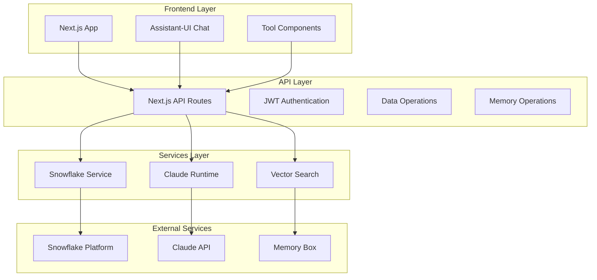

# 🧠 Snowflake Memory Box

[](https://nextjs.org/)
[](https://www.typescriptlang.org/)
[](https://www.snowflake.com/)
[](https://www.anthropic.com/)
[](https://mariadb.com/bsl11/)

A comprehensive demonstration of **AI-powered analytics with persistent memory**, built on Snowflake's data platform. This application showcases the seamless integration of Snowflake's Cortex AI capabilities with Memory Box for context-aware data analysis.


## 🏢 Memory Box: Enterprise-Ready AI Memory

**Memory Box** is a proven AI memory solution that has been successfully deployed in production environments to enhance the value and effectiveness of AI interactions. Originally developed as a standalone platform, Memory Box has now been **architected specifically for enterprise use on Snowflake**, bringing enterprise-grade security, scalability, and performance to AI-powered analytics.

### Why Memory Box on Snowflake?

- **🔒 Enterprise Security**: Memory data never leaves your Snowflake environment, ensuring maximum data security and compliance
- **📈 Proven Value**: Field-tested solution that demonstrably improves AI interaction quality and business outcomes  
- **🏗️ Native Architecture**: Purpose-built for Snowflake using Cortex AI functions for optimal performance
- **💰 Cost Efficiency**: Eliminates external API costs and data transfer fees while leveraging existing Snowflake infrastructure
- **⚡ Production Ready**: Enterprise-grade scalability and reliability with Snowflake's proven platform
- **🔧 Operational Simplicity**: No additional infrastructure to manage - Memory Box runs entirely within your Snowflake environment

This demo showcases how Memory Box transforms traditional data analytics into **intelligent, context-aware conversations** that remember insights, build upon previous analyses, and provide increasingly valuable recommendations over time.

## 🎯 What This Demo Shows

This project demonstrates how to build a **production-ready AI analytics application** that:

- 🗄️ **Explores Data Naturally**: Browse Snowflake databases using natural language
- 🤖 **Analyzes with AI**: Leverage Claude AI for intelligent data insights
- 🧠 **Remembers Everything**: Store and retrieve analysis results using Memory Box natively on Snowflake
- 💬 **Maintains Context**: Memory Box enables AI that remembers previous interactions and builds upon them
- 🔧 **Integrates Seamlessly**: Native Snowflake Cortex integration with Memory Box and modern web technologies

## ✨ Key Features

### 🚀 Core Capabilities
- **Database Explorer**: Interactive browsing of databases, schemas, and tables
- **AI Chat Interface**: Natural language conversations with Claude AI
- **Memory System**: Vector-based storage and retrieval of insights using Snowflake Cortex
- **Cortex Analyst**: Direct integration with Snowflake's native AI capabilities
- **Tool Integration**: Seamless tool calling within conversations

### 🛠️ Technical Highlights
- **Modern Stack**: Next.js 15, React 18, TypeScript, Tailwind CSS
- **Professional UI**: Assistant-UI for chat interface with tool support
- **Secure Authentication**: JWT-based Snowflake integration with RSA key pairs
- **Native Vector Search**: Snowflake Cortex embedding functions for similarity search
- **Production Ready**: Comprehensive error handling and responsive design

## 🏗️ Architecture Overview



## 🚀 Deployment Options

### Snowpark Container Services (SPCS) Deployment ✅

This application is **fully deployed and running on Snowpark Container Services**. For production deployments, SPCS provides:

- 🔒 **Complete Data Security**: All processing happens within your Snowflake environment
- 🚀 **Native Performance**: Direct integration with Snowflake services
- 📈 **Enterprise Scale**: Automatic scaling and high availability
- 🛡️ **Built-in Security**: Snowflake's enterprise security features
- 🔐 **Native Authentication**: Uses Snowflake OAuth tokens - no external auth required

**Current SPCS Deployment:**
- Backend Service: `memory-box-backend:v20` (RUNNING)
- Frontend Service: `memory-box-frontend:v5` (RUNNING)
- URL: https://your-url.snowflakecomputing.app

### 🔐 Enterprise Authentication Models

Memory Box supports **three authentication models** for different deployment scenarios:

#### Model A: Customer Self-Deploy (Enterprise)
- 🏢 **Target**: Large enterprises with existing Snowflake governance
- 🔑 **Auth**: Snowflake OAuth with corporate SSO integration
- ✅ **Status**: Fully implemented and demo-ready

#### Model B: Managed Service (Mid-Market)
- 🏢 **Target**: Organizations wanting simplified deployment
- 🔑 **Auth**: Service account with user validation layer
- ✅ **Status**: Fully implemented and demo-ready

#### Model C: Native App (Marketplace)
- 🏢 **Target**: All Snowflake customers via Marketplace
- 🔑 **Auth**: Native app permissions model
- 📋 **Status**: On roadmap


### Local Development Quick Start

#### Prerequisites

Before you begin, ensure you have:

- **Snowflake Account** with Cortex AI and Claude Sonneet 3.5 enabled
- **Node.js 18+** and npm/yarn
- **RSA Key Pair** for Snowflake authentication

### 1. Clone & Install

```bash
git clone https://github.com/amotivv-inc/snowflake-memory-box.git
cd snowflake-memory-box
npm install
```

### 2. Environment Setup

```bash
# Copy the environment template
cp .env.example .env.local

# Edit .env.local with your credentials
nano .env.local
```

Required environment variables:
```env
SNOWFLAKE_ACCOUNT=your-account-identifier
SNOWFLAKE_USERNAME=your-username
SNOWFLAKE_PRIVATE_KEY_PATH=/path/to/your/rsa_key.p8
SNOWFLAKE_PUBLIC_KEY_FP=your-public-key-fingerprint
```

### 3. Snowflake Setup

Run the setup script to create the necessary database and memory system:

```sql
-- Enable cross-region inference (if needed)
ALTER ACCOUNT SET CORTEX_ENABLED_CROSS_REGION = 'AWS_US';

-- Create memory database
CREATE DATABASE IF NOT EXISTS NATIVE_MEMORY_POC;
USE DATABASE NATIVE_MEMORY_POC;
CREATE SCHEMA IF NOT EXISTS CORE;

-- Create memories table with vector support
CREATE OR REPLACE TABLE CORE.MEMORIES (
    memory_id STRING PRIMARY KEY,
    content STRING NOT NULL,
    content_type STRING NOT NULL,
    embedding VECTOR(FLOAT, 768) NOT NULL,
    owner_user STRING NOT NULL DEFAULT CURRENT_USER(),
    access_level STRING NOT NULL DEFAULT 'PRIVATE',
    created_at TIMESTAMP_NTZ DEFAULT CURRENT_TIMESTAMP(),
    -- ... additional fields
);
```

### 4. Local Authentication Setup

Generate RSA key pair for Snowflake authentication:

```bash
# Create keys directory
mkdir -p ~/.snowflake/keys

# Generate private key
openssl genrsa -out ~/.snowflake/keys/rsa_key.pem 2048

# Convert to PKCS#8 format
openssl pkcs8 -topk8 -inform PEM -outform PEM -nocrypt \
  -in ~/.snowflake/keys/rsa_key.pem -out ~/.snowflake/keys/rsa_key.p8

# Generate public key
openssl rsa -in ~/.snowflake/keys/rsa_key.pem -pubout \
  -out ~/.snowflake/keys/rsa_key.pub

# Get fingerprint
openssl rsa -pubin -in ~/.snowflake/keys/rsa_key.pub -outform DER | \
  openssl dgst -sha256 -binary | openssl enc -base64
```

Configure the public key in Snowflake:
```sql
ALTER USER your_username SET RSA_PUBLIC_KEY='<your_public_key_content>';
```

### 5. Run the Application

```bash
# Start development server
npm run dev

# Open in browser
open http://localhost:3000
```

## 🎮 Usage Examples

### Data Exploration
```
👤 User: "Show me the available databases"
🤖 AI: [Uses selectDataSource tool to list databases]

👤 User: "What tables are in the NONPROFIT_POC database?"
🤖 AI: [Explores database structure and shows tables with details]
```

### AI-Powered Analysis
```
👤 User: "Analyze donation patterns in the last quarter"
🤖 AI: [Uses Cortex Analyst to generate SQL, executes query, provides insights]

👤 User: "Store this analysis for future reference"
🤖 AI: [Uses storeMemory tool to save insights with vector embeddings]
```

### Memory-Enhanced Conversations
```
👤 User: "What did we discover about donor behavior last time?"
🤖 AI: [Uses Memory Box to find relevant previous insights]
```

## 🔍 API Reference

### Data Operations
| Endpoint | Method | Description |
|----------|--------|-------------|
| `/api/data/databases` | GET | List available databases |
| `/api/data/schemas` | GET | List schemas in a database |
| `/api/data/tables` | GET | List tables in a schema |
| `/api/data/preview` | GET | Preview table data |
| `/api/data/query` | POST | Execute custom SQL queries |

### Memory Operations
| Endpoint | Method | Description |
|----------|--------|-------------|
| `/api/memory/store` | POST | Store insights with vector embeddings |
| `/api/memory/search` | POST | Search memories by similarity |

### AI Integration
| Endpoint | Method | Description |
|----------|--------|-------------|
| `/api/chat` | POST | Claude AI conversation handling |
| `/api/suggestions` | GET | Dynamic suggestion generation |

## 🧪 Testing

```bash
# Test API endpoints
curl -X GET http://localhost:3000/api/data/databases

# Test memory operations
curl -X POST http://localhost:3000/api/memory/search \
  -H "Content-Type: application/json" \
  -d '{"query": "donation analysis", "limit": 5}'
```

## 🚀 Deployment

### Development
```bash
npm run dev
```

### Production Build
```bash
npm run build
npm start
```


## 🔧 Technology Stack

| Category | Technology | Purpose |
|----------|------------|---------|
| **Frontend** | Next.js 15, React 18, TypeScript | Modern web application framework |
| **Styling** | Tailwind CSS | Utility-first CSS framework |
| **AI/Chat** | Assistant-UI, Claude (Anthropic) | Professional chat interface and AI |
| **Database** | Snowflake | Data platform and memory storage |
| **Vector Search** | Snowflake Cortex | Native embedding and similarity search |
| **Authentication** | JWT with RSA keys | Secure Snowflake integration |

## 🔒 Security Features

- 🔐 **JWT Authentication**: Secure token-based authentication with Snowflake
- 🔑 **RSA Key Pairs**: Industry-standard public/private key authentication
- 🛡️ **Input Sanitization**: SQL injection prevention and input validation
- 🔒 **Environment Variables**: Secure credential management
- 🚫 **Error Handling**: Secure error messages without data leakage

## 🤝 Contributing

We welcome contributions! Please see our contributing guidelines:

1. **Fork** the repository
2. **Create** a feature branch (`git checkout -b feature/amazing-feature`)
3. **Commit** your changes (`git commit -m 'Add amazing feature'`)
4. **Push** to the branch (`git push origin feature/amazing-feature`)
5. **Open** a Pull Request

### Development Setup
```bash
# Clone your fork
git clone https://github.com/yourusername/snowflake-memory-box.git

# Install dependencies
npm install

# Start development server
npm run dev
```

## 🆘 Troubleshooting

### Common Issues

**Authentication Errors**
```
Error: JWT token validation failed
```
- Verify public key is set in Snowflake
- Check private key path and permissions
- Ensure public key fingerprint matches

**Cross-Region Model Errors**
```
Error: Unknown model 'claude-3-sonnet'
```
- Enable cross-region inference: `ALTER ACCOUNT SET CORTEX_ENABLED_CROSS_REGION = 'AWS_US';`

**Memory Database Not Found**
```
Error: Database 'NATIVE_MEMORY_POC' does not exist
```
- Run the complete Snowflake setup script


## 📄 License

This project is licensed under the Business Source License 1.1 - see the [LICENSE](LICENSE) file for details.

**Key Points:**
- ✅ **Product use**: Production use allowed for entities with total finances under $2M USD annually
- ✅ **Open source future**: Automatically becomes AGPL-3.0 after 3 years
- ✅ **No restrictions for development**: Full access for development, testing, and evaluation
- 💼 **Enterprise licensing**: Commercial licenses available for larger organizations

For more information about BSL, visit [mariadb.com/bsl11](https://mariadb.com/bsl11/).

## 🏆 Achievements

This project successfully demonstrates:

- ✅ **Seamless Integration**: Direct Snowflake REST API v2 integration with modern web stack
- ✅ **AI-Powered Analytics**: Natural language data analysis with Claude AI
- ✅ **Vector Memory System**: Persistent context using Snowflake's native vector capabilities
- ✅ **Production Architecture**: Scalable, maintainable, and secure codebase
- ✅ **Comprehensive Documentation**: Complete setup guides and learning resources

## 🔮 Future Roadmap

- 🏢 **Multi-tenancy**: Support for multiple users and organizations
- 📊 **Advanced Visualizations**: Interactive charts and graphs
- 🤝 **Real-time Collaboration**: Shared analysis sessions
- 🏷️ **Enhanced Memory**: Tags, folders, and advanced organization
- 📈 **Analytics Dashboard**: Usage metrics and performance monitoring

## 🌟 Star History

[](https://star-history.com/#amotivv-inc/snowflake-memory-box&Date)

---

<div align="center">

**Built with ❤️ using [Memory Box](https://memorybox.dev), Snowflake, Claude AI, Next.js, and [Assistant-UI](https://github.com/assistant-ui/assistant-ui)**

[🌟 Star this repo](https://github.com/amotivv-inc/snowflake-memory-box) • [🐛 Report Bug](https://github.com/amotivv-inc/snowflake-memory-box/issues) • [💡 Request Feature](https://github.com/amotivv-inc/snowflake-memory-box/issues)

</div>
