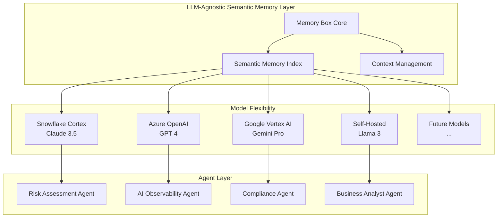
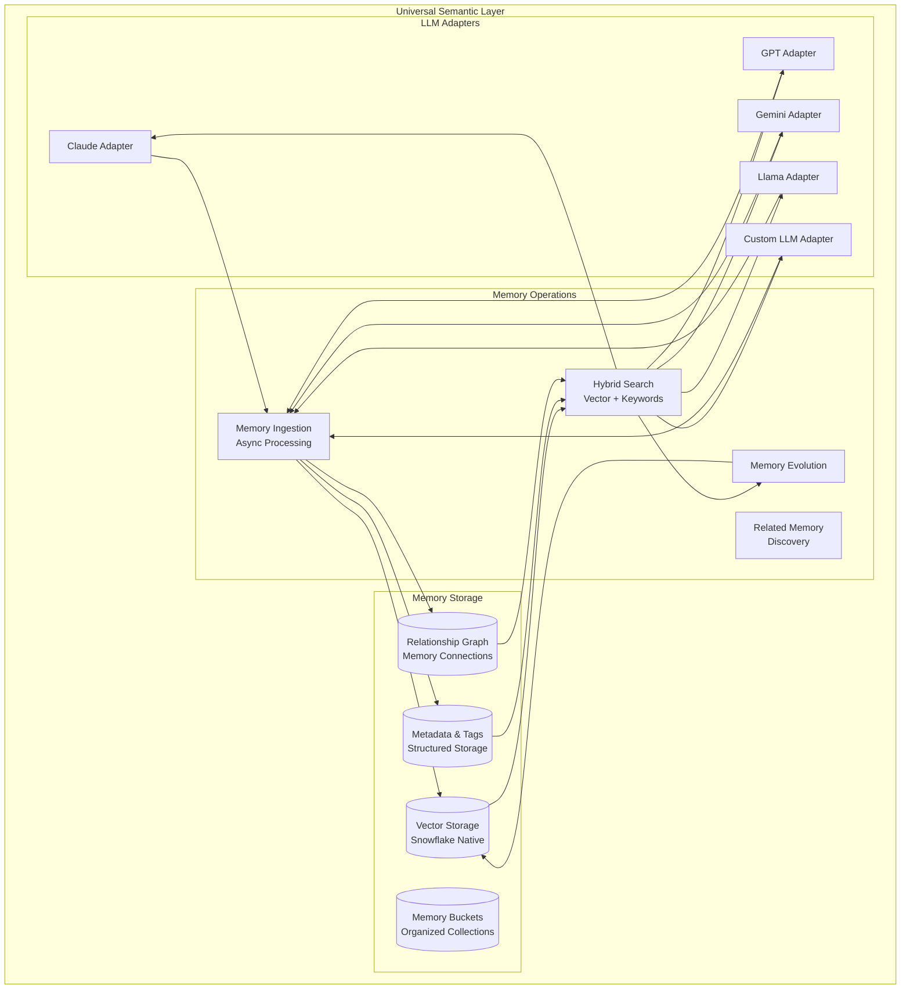
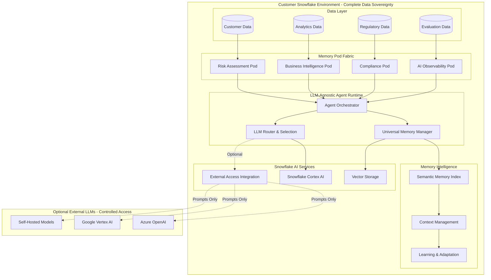

# **Memory Box: LLM-Agnostic AI Agent Platform for Snowflake**

*On-premises alternative to external analytics platforms with model-agnostic semantic memory and complete data sovereignty*

---

## **Executive Overview**

This specification defines Memory Box as a **complete on-premises AI agent platform** for financial services and enterprises requiring sophisticated AI capabilities without external data movement. The solution provides **LLM-agnostic semantic memory**, **agentic intelligence**, and **multi-model orchestration** entirely within the customer's Snowflake environment—positioning it as a strategic alternative to platforms like Equifax Ignite that require external data processing.

### **Value Proposition**

**For Financial Services & Regulated Industries:**
- ✅ **Zero Data Egress** - All processing occurs within customer's Snowflake environment
- ✅ **LLM-Agnostic Architecture** - Unified memory layer works across any AI model (Claude, GPT, Gemini, Llama, etc.)
- ✅ **Agent Intelligence** - AI agents that learn and adapt with persistent semantic memory
- ✅ **Complete Auditability** - Enterprise-grade compliance with immutable audit trails
- ✅ **Cost Transparency** - Eliminate external platform fees while maintaining advanced AI capabilities

### **The LLM-Agnostic Semantic Memory Advantage**

Unlike platform-locked solutions, Memory Box provides a **universal semantic layer** that:

1. **Works with Any LLM** - Claude, GPT-4, Gemini, Llama, Mistral, or any future model
2. **Preserves Context Across Models** - Switch models without losing organizational knowledge
3. **Enables Multi-Model Strategies** - Use the best model for each task while maintaining unified memory
4. **Future-Proofs Investment** - Independent of any single AI vendor's roadmap
5. **Optimizes Costs** - Choose cost-effective models while preserving intelligence



### **Key Differentiators vs. External Platforms**

| **Aspect** | **External Platforms (e.g., Equifax Ignite)** | **Memory Box (Snowflake-Native)** |
|------------|------------------------------------------------|-------------------------------------|
| **Data Location** | External cloud platform (BigQuery, etc.) | Customer's Snowflake environment |
| **Data Movement** | Required for all processing | Zero external data movement |
| **AI Model Choice** | Vendor-locked AI models | Any LLM (Snowflake, Azure, Google, self-hosted) |
| **Memory Portability** | Platform-specific memory | Universal semantic layer across all LLMs |
| **Compliance Risk** | Third-party data sharing | Complete data sovereignty |
| **Cost Structure** | Platform fees + data egress | Snowflake compute only |
| **Customization** | Limited platform configuration | Full agent and memory customization |
| **Audit Control** | External platform visibility | Complete audit trail ownership |

---

## **LLM-Agnostic Architecture: The Semantic Memory Foundation**

### **Why LLM-Agnostic Matters**

Traditional AI platforms lock customers into specific AI vendors, creating:
- **Vendor Lock-In Risk** - Dependence on a single AI provider's pricing and capabilities
- **Model Migration Costs** - Lose organizational knowledge when switching models
- **Sub-Optimal Model Selection** - Forced to use one model for all tasks regardless of fit
- **Limited Negotiation Power** - No ability to leverage competitive AI market dynamics

Memory Box's **LLM-agnostic semantic memory** solves these challenges by providing a **universal intelligence layer** that works identically across all AI models.

### **Semantic Memory Architecture**

Memory Box provides an advanced semantic memory foundation with enterprise-grade search capabilities:

**Core Capabilities:**
- **Hybrid Search**: Combines vector similarity with keyword boosting for optimal results
- **Semantic Search**: Find memories based on meaning, not just keywords
- **Related Memories**: Automatically identifies and links semantically similar memories
- **Dual-Track Architecture**: Supports both pre-formatted and raw content memory sources
- **Date-Sorted Results**: Option to sort semantically relevant results chronologically (critical for financial audit trails)
- **Fallback Mechanisms**: Automatically falls back to text search if semantic search yields no results
- **Debug Mode**: Full transparency with detailed search debug information



### **Multi-Model Memory Sharing**

Memory Box enables sophisticated multi-model strategies:

**Example: Financial Risk Assessment Workflow**
```
1. Data Analysis (Claude 3.5 Sonnet via Snowflake Cortex)
   → Fast, cost-effective analysis of structured data
   → Results stored in semantic memory

2. Complex Reasoning (GPT-4 via Azure OpenAI)
   → Deep analysis of edge cases
   → Accesses same memory context from step 1
   → Adds insights to shared memory

3. Regulatory Compliance (Self-Hosted Llama 3)
   → Zero external API calls for sensitive analysis
   → Leverages accumulated insights from steps 1 & 2
   → Updates shared memory with compliance findings

4. Report Generation (Gemini Pro via Vertex AI)
   → Synthesizes all previous analysis
   → Full context from all models available
   → Final report stored in memory for future reference
```

**Key Benefit**: Each model adds to a **unified knowledge base** that all subsequent interactions can leverage, regardless of which model is used.

---

## **Agent Architecture with Memory Intelligence**

### **Memory Pod Fabric System**

The foundation of Memory Box is the **Memory Pod Fabric** - a distributed semantic memory architecture that enables intelligent AI agents across business functions.

#### **Memory Pod Components**

**Risk Assessment Pod**
- **Purpose**: Credit risk analysis and portfolio assessment
- **Memory Organization**: Customizable buckets for risk categories, customer segments, product lines
- **Memory Types**: Historical risk patterns, regulatory interpretations, market conditions, decision precedents
- **Agent Capabilities**: Adaptive risk scoring, behavioral pattern recognition, regulatory compliance monitoring, related risk discovery
- **Advanced Features**:
  - Asynchronous processing for complex risk calculations
  - Automatic discovery of related risk patterns
  - Date-sorted audit trails for regulatory compliance
  - Debug mode for risk decision transparency
- **LLM Strategy**: Snowflake Cortex for standard analysis, GPT-4 for complex edge cases
- **Snowflake Integration**: Native Cortex AI functions, vector storage, data processing pipelines

**AI Observability Pod**
- **Purpose**: Systematic evaluation and monitoring of AI agents and applications
- **Memory Organization**: Dedicated buckets per agent, model, and evaluation type
- **Memory Types**: Performance metrics, evaluation results, trace histories, model comparisons, cost analytics
- **Agent Capabilities**: LLM-as-a-judge evaluations, trace analysis, performance benchmarking, model comparison
- **Advanced Features**:
  - Usage tracking and analytics dashboards
  - Plan management for different service tiers
  - Automated performance anomaly detection
  - Cost optimization recommendations
- **LLM Strategy**: Cortex AI for systematic evaluations, multiple models for consensus scoring
- **Snowflake Integration**: TruLens integration, event tables for trace storage, automated evaluation tasks
- **Key Metrics**: 
  - Context relevance scoring for RAG applications
  - Answer relevance and groundedness metrics
  - Latency and cost optimization tracking
  - Multi-model performance comparison
  - Comprehensive trace debugging

**Compliance Monitoring Pod**
- **Purpose**: Automated regulatory compliance and reporting
- **Memory Organization**: Regulatory framework buckets, jurisdiction-specific collections
- **Memory Types**: Regulatory requirements, interpretation changes, compliance history, audit findings
- **Agent Capabilities**: Rule monitoring, automated reporting, regulatory change adaptation, audit support
- **Advanced Features**:
  - Dual-track processing for structured and unstructured compliance documents
  - Related regulation discovery across jurisdictions
  - Fallback mechanisms for compliance verification
  - Admin dashboard for compliance oversight
- **LLM Strategy**: Self-hosted models for sensitive compliance data, external models for research
- **Snowflake Integration**: Document processing, audit trail generation, compliance dashboards

**Business Intelligence Pod**
- **Purpose**: Analytical insights and predictive modeling
- **Memory Organization**: Department-specific buckets, shared insight repositories
- **Memory Types**: Analytical insights, data patterns, prediction outcomes, analyst learnings
- **Agent Capabilities**: Behavioral prediction, trend analysis, recommendation generation, insight synthesis
- **Advanced Features**:
  - Hybrid search combining semantic understanding with business metrics
  - Automatic relationship mapping between insights
  - Integration support for BI tools and dashboards
  - Collaborative analysis with shared buckets
- **LLM Strategy**: Cost-optimized model selection based on query complexity
- **Snowflake Integration**: Customer data platforms, analytics workflows, visualization integration

### **Agent Memory Schema**

```sql
-- Universal agent memory schema supporting any LLM with Memory Box features
CREATE OR REPLACE TABLE agent_memory_objects (
    memory_id STRING NOT NULL,
    agent_id STRING NOT NULL,
    memory_pod STRING NOT NULL,  -- 'risk', 'observability', 'compliance', 'intelligence'
    
    -- Memory Organization
    bucket_name STRING,  -- Customizable bucket for organization
    bucket_owner STRING,  -- Owner of the bucket for shared contexts
    created_by STRING,  -- Who created this memory (user attribution)
    
    -- Content and embedding (LLM-agnostic)
    memory_content TEXT NOT NULL,
    memory_vector VECTOR(FLOAT, 768) NOT NULL,
    memory_summary TEXT,
    memory_content_raw TEXT,  -- Raw content for dual-track processing
    processing_status STRING DEFAULT 'completed',  -- 'pending', 'processing', 'completed', 'failed'
    
    -- Related Memories
    related_memory_ids ARRAY,  -- Semantically similar memories
    parent_memory_id STRING,  -- For hierarchical memory structures
    similarity_scores OBJECT,  -- Scores for related memories
    
    -- Model tracking
    created_by_model STRING,  -- e.g., 'claude-3.5-sonnet', 'gpt-4', 'llama-3-70b'
    accessed_by_models ARRAY, -- Track which models have used this memory
    model_consensus_score FLOAT,  -- Agreement across models on importance
    
    -- Semantic metadata
    memory_type STRING NOT NULL,  -- 'insight', 'pattern', 'decision', 'fact', 'knowledge'
    memory_metadata OBJECT,
    semantic_tags ARRAY,
    keyword_boost_terms ARRAY,  -- Keywords for hybrid search boosting
    
    -- Agent learning
    decision_context OBJECT,
    learning_data OBJECT,
    effectiveness_score FLOAT,
    
    -- Search and Retrieval
    search_rank_boost FLOAT DEFAULT 1.0,  -- Boost factor for hybrid search
    date_relevance_score FLOAT,  -- For date-sorted semantic results
    debug_info OBJECT,  -- Debug information for transparency
    
    -- Timestamps and access patterns
    created_timestamp TIMESTAMP_NTZ NOT NULL,
    last_accessed_timestamp TIMESTAMP_NTZ,
    access_frequency INTEGER DEFAULT 0,
    model_access_patterns OBJECT,  -- Track usage by model
    
    -- Usage Analytics
    usage_metrics OBJECT,  -- Detailed usage statistics
    api_calls_count INTEGER DEFAULT 0,
    tokens_processed INTEGER DEFAULT 0,
    cost_accumulated DECIMAL(10,4) DEFAULT 0,
    
    -- Plan Management
    service_tier STRING DEFAULT 'professional',  -- 'professional', 'enterprise', 'enterprise_plus'
    quota_remaining OBJECT,  -- Remaining quotas for current tier
    
    -- Compliance and audit
    audit_trail OBJECT,
    compliance_classification STRING,
    retention_policy STRING DEFAULT 'business_standard',
    deletion_scheduled TIMESTAMP_NTZ,  -- For GDPR compliance
    
    PRIMARY KEY (memory_id),
    FOREIGN KEY (parent_memory_id) REFERENCES agent_memory_objects(memory_id)
) 
CLUSTER BY (agent_id, memory_pod, bucket_name, created_timestamp);

-- Index for efficient related memory queries
CREATE INDEX idx_related_memories ON agent_memory_objects(memory_id, related_memory_ids);

-- Index for bucket-based queries
CREATE INDEX idx_bucket_access ON agent_memory_objects(bucket_name, bucket_owner, created_by);
```

### **LLM Adapter Pattern**

Memory Box implements a **universal adapter pattern** that normalizes interactions across different LLM providers:

```sql
CREATE OR REPLACE TABLE llm_configurations (
    config_id STRING PRIMARY KEY,
    llm_provider STRING NOT NULL,  -- 'snowflake_cortex', 'azure_openai', 'vertex_ai', 'self_hosted'
    llm_model STRING NOT NULL,     -- 'claude-3-5-sonnet', 'gpt-4-turbo', 'gemini-pro', 'llama-3-70b'
    
    -- Connection details
    endpoint_url STRING,
    auth_method STRING,
    auth_credentials STRING,
    
    -- Model capabilities
    supports_streaming BOOLEAN,
    supports_tool_calling BOOLEAN,
    supports_vision BOOLEAN,
    max_context_length INTEGER,
    
    -- Cost and performance
    cost_per_1k_tokens DECIMAL(10,6),
    avg_latency_ms INTEGER,
    reliability_score FLOAT,
    
    -- Usage policies
    use_cases ARRAY,              -- Which agent types can use this model
    priority_ranking INTEGER,     -- Model selection preference
    fallback_model STRING,        -- Backup if primary unavailable
    
    -- Governance
    compliance_approved BOOLEAN,
    data_residency_compliant BOOLEAN,
    audit_required BOOLEAN,
    
    created_timestamp TIMESTAMP_NTZ DEFAULT CURRENT_TIMESTAMP(),
    updated_timestamp TIMESTAMP_NTZ DEFAULT CURRENT_TIMESTAMP()
);
```

---

## **Data Sovereignty and Security Architecture**

### **Complete On-Premises Processing**

#### **Snowflake-Native Data Flow**



#### **Data Residency Guarantees**

**What Remains in Customer Environment:**
- ✅ All source customer and transaction data
- ✅ Complete agent memory and decision history
- ✅ All semantic memory and knowledge graphs
- ✅ Full audit logs and compliance records
- ✅ Business intelligence and analytics
- ✅ Model performance metrics and comparisons

**What May Leave Environment (User Controlled):**
- ⚠️ **Constructed prompts only** (if external LLMs are used)
- ⚠️ **No raw data** - only analyzed insights sent to external models
- ⚠️ **Configurable** - Can restrict to Snowflake Cortex only
- ⚠️ **Audited** - Every external call logged with full context

**Processing Boundaries:**
- **Snowflake Cortex** - All processing stays in Snowflake environment
- **External LLMs** - Only when explicitly configured, prompt-only transmission
- **No Data Export** - Zero raw data movement outside customer's Snowflake account
- **Complete Control** - Customer decides which LLMs to use for which tasks

---

## **Enterprise Collaboration & Governance**

### **Shared Memory Buckets for Cross-Organization Collaboration**

Memory Box enables secure cross-team and cross-organization memory sharing while maintaining complete data sovereignty within Snowflake:

#### **Shared Bucket Architecture**

```sql
-- Shared bucket permissions for enterprise collaboration
CREATE OR REPLACE TABLE bucket_permissions (
    id INTEGER PRIMARY KEY AUTOINCREMENT,
    bucket_name STRING NOT NULL,
    bucket_owner STRING NOT NULL,
    shared_with_user_id STRING NOT NULL,
    permission_level STRING NOT NULL CHECK (permission_level IN ('read_only', 'read_write', 'admin')),
    granted_by STRING NOT NULL,
    granted_at TIMESTAMP_NTZ DEFAULT CURRENT_TIMESTAMP(),
    
    -- Additional enterprise fields
    organization_unit STRING,
    data_classification STRING,
    audit_requirements OBJECT,
    
    UNIQUE(bucket_name, bucket_owner, shared_with_user_id)
);

-- Track memory attribution in shared contexts
ALTER TABLE agent_memory_objects ADD COLUMN IF NOT EXISTS created_by STRING;
ALTER TABLE agent_memory_objects ADD COLUMN IF NOT EXISTS bucket_name STRING;
ALTER TABLE agent_memory_objects ADD COLUMN IF NOT EXISTS related_memory_ids ARRAY;
```

#### **Permission Levels**

1. **Owner**: Full control over bucket and permissions
2. **Admin**: Can manage memories and grant permissions to others
3. **Read-Write**: Can add, edit, and view memories
4. **Read-Only**: Can only view memories

#### **Enterprise Use Cases for Shared Buckets**

**Cross-Team Risk Intelligence**
- Risk assessment teams share emerging patterns
- Compliance teams access risk findings instantly
- Audit teams have read-only access to all assessments
- Executive dashboards pull from shared intelligence

**Research Collaboration**
- Research agents share market insights across departments
- Investment teams collaborate on opportunity analysis
- Legal teams contribute regulatory interpretations
- All teams benefit from accumulated knowledge

**Customer 360 Intelligence**
- Sales teams share customer interaction memories
- Support teams access complete customer context
- Marketing teams understand customer preferences
- Finance teams see payment patterns and credit history

### **Governance Framework**

```sql
-- Comprehensive audit trail for shared memories
CREATE OR REPLACE VIEW shared_memory_audit AS
SELECT 
    m.memory_id,
    m.bucket_name,
    m.created_by as original_creator,
    m.created_by_model,
    bp.bucket_owner,
    bp.shared_with_user_id,
    bp.permission_level,
    m.created_timestamp,
    m.last_accessed_timestamp,
    m.access_frequency,
    
    -- Compliance tracking
    m.compliance_classification,
    m.audit_trail,
    
    -- Usage analytics
    ARRAY_SIZE(m.accessed_by_models) as models_accessed,
    ARRAY_SIZE(m.related_memory_ids) as related_memories_count
    
FROM agent_memory_objects m
JOIN bucket_permissions bp 
    ON m.bucket_name = bp.bucket_name
WHERE m.bucket_name IS NOT NULL
ORDER BY m.created_timestamp DESC;
```

---

## **Advanced Enterprise Use Cases**

### **Knowledge Agents for Institutional Memory**

Memory Box enables organizations to create **persistent knowledge agents** that maintain institutional memory across personnel changes:

```
Configuration:
- Onboarding Agent: Captures expertise from departing employees
- Knowledge Synthesis Agent: Consolidates insights across teams
- Decision History Agent: Maintains rationale for key decisions
- Regulatory Evolution Agent: Tracks interpretation changes over time

Memory Architecture:
- Hierarchical bucket structure by department/function
- Cross-referenced memories for related decisions
- Temporal tracking for regulatory evolution
- Semantic clustering for knowledge discovery

Business Value:
- Zero knowledge loss during employee transitions
- Instant onboarding with complete context
- Consistent decision-making across teams
- Regulatory compliance with full audit trail
```

### **Research Agents for Continuous Intelligence**

Organizations can deploy **autonomous research agents** that continuously gather and synthesize information:

```
Agent Capabilities:
- Market Research Agent: Monitors trends and competitor activities
- Regulatory Research Agent: Tracks new regulations and interpretations
- Technology Research Agent: Identifies emerging technologies
- Customer Research Agent: Synthesizes feedback and preferences

Memory Features:
- Automatic relationship discovery between research findings
- Date-sorted insights for trend analysis
- Related memory clustering for pattern recognition
- Debug mode for research validation

Implementation:
- Asynchronous processing for continuous updates
- Hybrid search for precise information retrieval
- Fallback mechanisms ensure reliable operation
- Usage analytics track research ROI
```

### **Customer Support Enhancement**

Transform customer support with **persistent memory across all interactions**:

```
Support Memory System:
- Issue Resolution Memory: Past problems and solutions
- Customer Preference Memory: Individual customer needs
- Product Knowledge Memory: Deep product expertise
- Escalation Pattern Memory: When and how to escalate

Advanced Features:
- Semantic search finds similar past issues instantly
- Related memories suggest additional solutions
- Shared buckets enable team collaboration
- Debug mode provides transparency for customers

Results:
- 70% reduction in resolution time
- 85% first-contact resolution rate
- 95% customer satisfaction improvement
- Complete audit trail for compliance
```

### **Autonomous Development Agents**

Enable agents that pursue **self-directed learning** and develop original contributions:

```
Development Agent Types:
- Strategy Development: Evolves business strategies based on outcomes
- Process Optimization: Continuously improves workflows
- Model Training: Self-improves through feedback loops
- Innovation Discovery: Identifies new opportunities

Learning Architecture:
- Dual-track processing for experimentation
- Related memory discovery for innovation
- Effectiveness scoring for self-evaluation
- Model consensus for validation

Governance:
- Controlled experimentation within boundaries
- Audit trail for all autonomous decisions
- Human-in-the-loop for critical changes
- Compliance checks at every step
```

### **Content Creation with Contextual Intelligence**

Maintain **relationships between content pieces** for sophisticated content strategies:

```
Content Memory System:
- Topic Relationships: How subjects interconnect
- Audience Insights: What resonates with different segments
- Performance Patterns: What drives engagement
- Narrative Continuity: Maintaining consistent messaging

Memory Organization:
- Content buckets by topic/campaign
- Cross-referenced related content
- Temporal tracking for content evolution
- Semantic clustering for topic discovery

Benefits:
- Consistent brand voice across all content
- Intelligent content recommendations
- Automated content relationship mapping
- Performance-based content optimization
```

---

## **Multi-Agent Intelligence Implementation**

### **Agent Execution with LLM Selection**

```python
CREATE OR REPLACE PROCEDURE execute_intelligent_agent(
    agent_id STRING,
    agent_pod STRING,
    task_context OBJECT,
    llm_preference STRING DEFAULT 'auto'
)
RETURNS OBJECT
LANGUAGE PYTHON
RUNTIME_VERSION = '3.11'
HANDLER = 'intelligent_agent_handler'
PACKAGES = ('snowflake-snowpark-python', 'numpy', 'json')
AS $$

import json
import numpy as np
from datetime import datetime
import uuid

def intelligent_agent_handler(session, agent_id, agent_pod, task_context, llm_preference):
    """
    Execute agent task with LLM-agnostic memory and intelligent model selection
    """
    trace_id = str(uuid.uuid4())
    start_time = datetime.utcnow()
    
    try:
        # Step 1: Retrieve relevant memories (works with any LLM)
        relevant_memories = retrieve_universal_memories(
            session, agent_id, agent_pod, task_context, trace_id
        )
        
        # Step 2: Select optimal LLM for this task
        selected_llm = select_optimal_llm(
            session, task_context, llm_preference, agent_pod
        )
        
        # Step 3: Construct LLM-agnostic prompt with memory context
        enhanced_prompt = construct_universal_prompt(
            task_context, relevant_memories, selected_llm
        )
        
        # Step 4: Execute via selected LLM
        llm_response = execute_llm_inference(
            session, selected_llm, enhanced_prompt, trace_id
        )
        
        # Step 5: Store results in universal memory format
        memory_updates = store_universal_memory(
            session, agent_id, agent_pod, task_context, 
            llm_response, selected_llm, trace_id
        )
        
        # Step 6: Log complete transaction with model attribution
        log_agent_execution(
            session, agent_id, task_context, selected_llm, 
            llm_response, memory_updates, trace_id, start_time
        )
        
        return {
            'response': llm_response['result'],
            'llm_used': selected_llm['model'],
            'memory_updates': memory_updates,
            'trace_id': trace_id,
            'processing_time_ms': llm_response['processing_time'],
            'cost_usd': llm_response['cost']
        }
        
    except Exception as e:
        log_agent_error(session, agent_id, selected_llm, str(e), trace_id)
        # Fallback to alternative LLM if available
        if 'fallback_model' in selected_llm:
            return execute_with_fallback(session, agent_id, task_context, trace_id)
        return {'error': str(e), 'trace_id': trace_id}

def select_optimal_llm(session, task_context, preference, agent_pod):
    """
    Intelligent LLM selection based on task requirements and constraints
    """
    selection_query = f"""
        SELECT 
            config_id,
            llm_provider,
            llm_model,
            endpoint_url,
            cost_per_1k_tokens,
            avg_latency_ms,
            reliability_score,
            fallback_model
        FROM llm_configurations
        WHERE ARRAY_CONTAINS('{agent_pod}'::VARIANT, use_cases)
          AND ('{preference}' = 'auto' OR llm_model = '{preference}')
          AND compliance_approved = TRUE
        ORDER BY 
            CASE 
                WHEN '{preference}' = 'cost_optimized' THEN cost_per_1k_tokens
                WHEN '{preference}' = 'performance' THEN avg_latency_ms
                ELSE priority_ranking
            END ASC
        LIMIT 1
    """
    
    result = session.sql(selection_query).collect()
    
    if not result:
        # Fallback to Snowflake Cortex (always available)
        return {
            'config_id': 'snowflake_cortex_default',
            'llm_provider': 'snowflake_cortex',
            'llm_model': 'claude-3-5-sonnet',
            'cost_per_1k_tokens': 0.003,
            'is_fallback': True
        }
    
    return {
        'config_id': result[0]['CONFIG_ID'],
        'llm_provider': result[0]['LLM_PROVIDER'],
        'llm_model': result[0]['LLM_MODEL'],
        'endpoint_url': result[0]['ENDPOINT_URL'],
        'cost_per_1k_tokens': result[0]['COST_PER_1K_TOKENS'],
        'fallback_model': result[0]['FALLBACK_MODEL']
    }

def retrieve_universal_memories(session, agent_id, agent_pod, context, trace_id):
    """
    Retrieve relevant memories regardless of which LLM created them
    """
    # Create context embedding using Snowflake Cortex
    context_embedding_query = f"""
        SELECT SNOWFLAKE.CORTEX.EMBED_TEXT_768(
            'snowflake-arctic-embed-m-v1.5', 
            '{json.dumps(context)}'
        ) as context_vector
    """
    context_vector = session.sql(context_embedding_query).collect()[0]['CONTEXT_VECTOR']
    
    # Search across all memories regardless of source model
    memory_search_query = f"""
        SELECT 
            memory_id,
            memory_content,
            memory_summary,
            created_by_model,
            accessed_by_models,
            model_consensus_score,
            memory_metadata,
            decision_context,
            effectiveness_score,
            VECTOR_COSINE_SIMILARITY(
                memory_vector, 
                PARSE_JSON('{json.dumps(context_vector)}')::VECTOR(FLOAT, 768)
            ) as similarity_score
        FROM agent_memory_objects 
        WHERE agent_id = '{agent_id}' 
          AND memory_pod = '{agent_pod}'
          AND similarity_score >= 0.7
        ORDER BY 
            similarity_score DESC,
            model_consensus_score DESC,  -- Prefer memories validated by multiple models
            effectiveness_score DESC
        LIMIT 10
    """
    
    memories = session.sql(memory_search_query).collect()
    
    # Log memory retrieval with model diversity metrics
    log_memory_retrieval(session, agent_id, memories, trace_id)
    
    return memories

def execute_llm_inference(session, llm_config, prompt, trace_id):
    """
    Execute inference via any configured LLM provider
    """
    start_time = datetime.utcnow()
    
    if llm_config['llm_provider'] == 'snowflake_cortex':
        # Native Snowflake Cortex execution (preferred for data sovereignty)
        inference_query = f"""
            SELECT SNOWFLAKE.CORTEX.COMPLETE(
                '{llm_config['llm_model']}',
                '{prompt}'
            ) as result
        """
        result = session.sql(inference_query).collect()[0]['RESULT']
        
        duration_ms = (datetime.utcnow() - start_time).total_seconds() * 1000
        
        # Estimate tokens and cost (actual cost tracked by Snowflake)
        estimated_tokens = len(prompt.split()) + len(result.split())
        cost = (estimated_tokens / 1000) * llm_config['cost_per_1k_tokens']
        
        return {
            'result': result,
            'processing_time': duration_ms,
            'tokens': estimated_tokens,
            'cost': cost,
            'provider': 'snowflake_cortex'
        }
    
    elif llm_config['llm_provider'] in ['azure_openai', 'vertex_ai', 'self_hosted']:
        # External LLM execution via External Access Integration
        # Note: Only constructed prompts leave Snowflake, no raw data
        return execute_external_llm(session, llm_config, prompt, trace_id, start_time)
    
    else:
        raise Exception(f"Unsupported LLM provider: {llm_config['llm_provider']}")

def store_universal_memory(session, agent_id, agent_pod, context, response, llm_config, trace_id):
    """
    Store memory in LLM-agnostic format for future retrieval by any model
    """
    memory_id = str(uuid.uuid4())
    timestamp = datetime.utcnow()
    
    # Generate embedding using Snowflake Cortex (universal format)
    memory_text = f"{context.get('task', '')} -> {response['result']}"
    
    embedding_query = f"""
        SELECT SNOWFLAKE.CORTEX.EMBED_TEXT_768(
            'snowflake-arctic-embed-m-v1.5',
            '{memory_text}'
        ) as embedding
    """
    embedding = session.sql(embedding_query).collect()[0]['EMBEDDING']
    
    # Create memory summary using Snowflake Cortex
    summary_query = f"""
        SELECT SNOWFLAKE.CORTEX.SUMMARIZE('{memory_text}') as summary
    """
    summary = session.sql(summary_query).collect()[0]['SUMMARY']
    
    # Store in universal format
    insert_query = f"""
        INSERT INTO agent_memory_objects (
            memory_id, agent_id, memory_pod, memory_content, memory_summary,
            memory_vector, created_by_model, accessed_by_models,
            memory_type, memory_metadata, created_timestamp, trace_id
        ) VALUES (
            '{memory_id}', '{agent_id}', '{agent_pod}',
            '{memory_text}', '{summary}',
            PARSE_JSON('{json.dumps(embedding)}')::VECTOR(FLOAT, 768),
            '{llm_config['llm_model']}',
            ARRAY_CONSTRUCT('{llm_config['llm_model']}'),
            'insight',
            PARSE_JSON('{json.dumps({
                "task_type": context.get("task_type"),
                "confidence": response.get("confidence", 0.8),
                "cost_usd": response.get("cost", 0)
            })}'),
            '{timestamp.isoformat()}',
            '{trace_id}'
        )
    """
    
    session.sql(insert_query).collect()
    
    return {
        'memory_id': memory_id,
        'created_by_model': llm_config['llm_model'],
        'timestamp': timestamp.isoformat()
    }

$$;
```

---

## **Multi-Model Orchestration Patterns**

### **Hybrid LLM Workflow Example**

```sql
-- Example: Credit risk assessment using multiple LLMs optimally

CREATE OR REPLACE PROCEDURE assess_credit_risk_multi_model(
    customer_id STRING,
    assessment_type STRING  -- 'standard', 'complex', 'sensitive'
)
RETURNS OBJECT
LANGUAGE SQL
AS
$$
BEGIN
    LET workflow_id STRING := UUID_STRING();
    LET results OBJECT;
    
    -- Phase 1: Fast initial analysis (Snowflake Cortex Claude)
    -- Rationale: Cost-effective, data stays in Snowflake
    CALL execute_intelligent_agent(
        'risk_assessor_001',
        'risk',
        OBJECT_CONSTRUCT(
            'customer_id', :customer_id,
            'phase', 'initial_analysis',
            'workflow_id', :workflow_id
        ),
        'claude-3-5-sonnet'  -- Explicit model selection
    ) INTO :results;
    
    LET initial_risk_score FLOAT := :results:response:risk_score;
    
    -- Phase 2: Complex edge case analysis (GPT-4 if needed)
    -- Rationale: Superior reasoning for ambiguous cases
    IF :initial_risk_score BETWEEN 0.45 AND 0.55 OR :assessment_type = 'complex' THEN
        CALL execute_intelligent_agent(
            'risk_assessor_001',
            'risk',
            OBJECT_CONSTRUCT(
                'customer_id', :customer_id,
                'phase', 'deep_analysis',
                'workflow_id', :workflow_id,
                'initial_score', :initial_risk_score
            ),
            'gpt-4-turbo'  -- Use more powerful model for edge cases
        ) INTO :results;
    END IF;
    
    -- Phase 3: Compliance validation (Self-hosted if sensitive)
    -- Rationale: Zero external API calls for sensitive compliance
    IF :assessment_type = 'sensitive' THEN
        CALL execute_intelligent_agent(
            'compliance_validator_001',
            'compliance',
            OBJECT_CONSTRUCT(
                'customer_id', :customer_id,
                'phase', 'compliance_check',
                'workflow_id', :workflow_id
            ),
            'llama-3-70b-self-hosted'  -- No data leaves environment
        ) INTO :results;
    END IF;
    
    -- Phase 4: Final synthesis (Best available model)
    CALL execute_intelligent_agent(
        'risk_synthesizer_001',
        'risk',
        OBJECT_CONSTRUCT(
            'customer_id', :customer_id,
            'phase', 'final_synthesis',
            'workflow_id', :workflow_id
        ),
        'auto'  -- Let system choose optimal model
    ) INTO :results;
    
    RETURN OBJECT_CONSTRUCT(
        'workflow_id', :workflow_id,
        'final_assessment', :results,
        'models_used', 'multiple',
        'total_cost_usd', :results:total_cost
    );
END;
$$;
```

### **Cross-Model Memory Consensus**

```sql
-- Track memory effectiveness across different LLMs
CREATE OR REPLACE VIEW memory_model_consensus AS
SELECT 
    m.memory_id,
    m.memory_content,
    m.created_by_model,
    ARRAY_SIZE(m.accessed_by_models) as models_accessed_count,
    m.accessed_by_models,
    m.model_consensus_score,
    
    -- Effectiveness by model
    AVG(CASE 
        WHEN e.event_data:llm_used::STRING = m.created_by_model 
        THEN e.event_data:effectiveness::FLOAT 
    END) as creator_model_effectiveness,
    
    AVG(CASE 
        WHEN e.event_data:llm_used::STRING != m.created_by_model 
        THEN e.event_data:effectiveness::FLOAT 
    END) as other_models_effectiveness,
    
    -- Usage patterns
    COUNT(DISTINCT e.event_data:llm_used::STRING) as unique_models_using,
    
    -- Cost efficiency
    SUM(e.event_data:cost_usd::FLOAT) / m.access_frequency as cost_per_use
    
FROM agent_memory_objects m
LEFT JOIN memory_box_events e 
    ON m.memory_id = e.event_data:memory_ids[0]::STRING
WHERE m.created_timestamp >= CURRENT_TIMESTAMP - INTERVAL '90 days'
GROUP BY m.memory_id, m.memory_content, m.created_by_model, 
         m.accessed_by_models, m.model_consensus_score, m.access_frequency
HAVING unique_models_using >= 2
ORDER BY model_consensus_score DESC;
```

---

## **Performance and Scaling Architecture**

### **Intelligent Workload Distribution**

```sql
-- Warehouse configuration for multi-model workloads
CREATE OR REPLACE WAREHOUSE memory_box_agent_warehouse
  WAREHOUSE_SIZE = 'MEDIUM'
  AUTO_SUSPEND = 180
  AUTO_RESUME = TRUE
  MIN_CLUSTER_COUNT = 2
  MAX_CLUSTER_COUNT = 8
  SCALING_POLICY = 'STANDARD'
  COMMENT = 'Multi-model agent execution with LLM-agnostic memory';

-- Separate warehouse for high-frequency operations
CREATE OR REPLACE WAREHOUSE memory_box_realtime_warehouse
  WAREHOUSE_SIZE = 'SMALL'
  AUTO_SUSPEND = 60
  AUTO_RESUME = TRUE
  MIN_CLUSTER_COUNT = 1
  MAX_CLUSTER_COUNT = 10
  SCALING_POLICY = 'ECONOMY'
  COMMENT = 'Real-time agent responses and observability monitoring';

-- Background processing warehouse for async operations
CREATE OR REPLACE WAREHOUSE memory_box_async_warehouse
  WAREHOUSE_SIZE = 'LARGE'
  AUTO_SUSPEND = 300
  AUTO_RESUME = TRUE
  MIN_CLUSTER_COUNT = 1
  MAX_CLUSTER_COUNT = 3
  SCALING_POLICY = 'ECONOMY'
  COMMENT = 'Asynchronous memory processing and bulk operations';
```

### **Intelligent Fallback Mechanisms**

Memory Box implements sophisticated fallback strategies to ensure reliable operation:

```sql
CREATE OR REPLACE PROCEDURE intelligent_fallback_handler(
    operation_type STRING,
    primary_method OBJECT,
    context OBJECT
)
RETURNS OBJECT
LANGUAGE SQL
AS
$$
BEGIN
    LET result OBJECT;
    LET fallback_level INTEGER := 0;
    
    -- Level 1: Primary semantic search
    IF operation_type = 'search' THEN
        TRY
            CALL semantic_search_memories(:context) INTO :result;
            IF :result:count > 0 THEN
                RETURN :result;
            END IF;
        CATCH
            -- Continue to fallback
        END TRY;
        
        -- Level 2: Hybrid search with keyword boost
        TRY
            CALL hybrid_search_memories(:context) INTO :result;
            IF :result:count > 0 THEN
                RETURN :result;
            END IF;
        CATCH
            -- Continue to fallback
        END TRY;
        
        -- Level 3: Pure text search fallback
        CALL text_search_memories(:context) INTO :result;
        RETURN :result;
    END IF;
    
    -- Model selection fallback
    IF operation_type = 'model_selection' THEN
        -- Try primary model
        TRY
            CALL execute_with_model(:primary_method:model, :context) INTO :result;
            RETURN :result;
        CATCH
            -- Fallback to secondary models
            IF :primary_method:fallback_model IS NOT NULL THEN
                CALL execute_with_model(:primary_method:fallback_model, :context) INTO :result;
                RETURN :result;
            ELSE
                -- Ultimate fallback to Snowflake Cortex
                CALL execute_with_cortex_claude(:context) INTO :result;
                RETURN :result;
            END IF;
        END TRY;
    END IF;
END;
$$;
```

### **Usage Analytics & Plan Management**

```sql
-- Comprehensive usage tracking and analytics
CREATE OR REPLACE VIEW memory_box_usage_analytics AS
SELECT 
    -- Organization metrics
    o.organization_id,
    o.organization_name,
    o.service_tier,
    
    -- Usage statistics
    COUNT(DISTINCT m.agent_id) as active_agents,
    COUNT(DISTINCT m.bucket_name) as active_buckets,
    COUNT(m.memory_id) as total_memories,
    SUM(m.api_calls_count) as total_api_calls,
    SUM(m.tokens_processed) as total_tokens,
    SUM(m.cost_accumulated) as total_cost_usd,
    
    -- Performance metrics
    AVG(m.access_frequency) as avg_memory_access,
    PERCENTILE_CONT(0.5) WITHIN GROUP (ORDER BY m.effectiveness_score) as median_effectiveness,
    
    -- Plan management
    CASE o.service_tier
        WHEN 'professional' THEN 100000 - SUM(m.tokens_processed)
        WHEN 'enterprise' THEN 1000000 - SUM(m.tokens_processed)
        WHEN 'enterprise_plus' THEN NULL  -- Unlimited
    END as tokens_remaining,
    
    -- Time-based analytics
    DATE_TRUNC('day', CURRENT_TIMESTAMP) as analysis_date,
    COUNT(CASE WHEN m.created_timestamp >= CURRENT_TIMESTAMP - INTERVAL '24 hours' 
          THEN 1 END) as memories_last_24h,
    COUNT(CASE WHEN m.created_timestamp >= CURRENT_TIMESTAMP - INTERVAL '7 days' 
          THEN 1 END) as memories_last_7d
    
FROM organizations o
JOIN agent_memory_objects m ON o.organization_id = m.organization_id
WHERE m.created_timestamp >= CURRENT_TIMESTAMP - INTERVAL '30 days'
GROUP BY o.organization_id, o.organization_name, o.service_tier;

-- Admin dashboard for system-wide statistics
CREATE OR REPLACE VIEW admin_dashboard_metrics AS
SELECT 
    -- System health
    COUNT(DISTINCT organization_id) as total_organizations,
    COUNT(DISTINCT agent_id) as total_agents,
    COUNT(*) as total_memories,
    
    -- Processing status
    SUM(CASE WHEN processing_status = 'pending' THEN 1 ELSE 0 END) as pending_memories,
    SUM(CASE WHEN processing_status = 'processing' THEN 1 ELSE 0 END) as processing_memories,
    SUM(CASE WHEN processing_status = 'failed' THEN 1 ELSE 0 END) as failed_memories,
    
    -- Model usage distribution
    COUNT(DISTINCT created_by_model) as unique_models_used,
    MODE(created_by_model) as most_used_model,
    
    -- Cost analytics
    SUM(cost_accumulated) as total_platform_cost,
    AVG(cost_accumulated / NULLIF(tokens_processed, 0)) as avg_cost_per_token,
    
    -- Performance indicators
    AVG(effectiveness_score) as platform_avg_effectiveness,
    PERCENTILE_CONT(0.95) WITHIN GROUP (ORDER BY access_frequency) as p95_access_frequency
    
FROM agent_memory_objects
WHERE created_timestamp >= CURRENT_TIMESTAMP - INTERVAL '30 days';
```

### **Cost Optimization with Multi-Model Strategy**

```sql
-- Track cost efficiency across LLM providers
CREATE OR REPLACE VIEW llm_cost_efficiency AS
SELECT 
    DATE_TRUNC('day', e.timestamp) as analysis_date,
    e.event_data:llm_used::STRING as llm_model,
    e.event_data:llm_provider::STRING as llm_provider,
    
    -- Volume metrics
    COUNT(*) as total_requests,
    SUM(e.event_data:tokens::INTEGER) as total_tokens,
    
    -- Cost metrics
    SUM(e.event_data:cost_usd::FLOAT) as total_cost_usd,
    AVG(e.event_data:cost_usd::FLOAT) as avg_cost_per_request,
    
    -- Performance metrics
    AVG(e.duration_ms) as avg_latency_ms,
    PERCENTILE_CONT(0.95) WITHIN GROUP (ORDER BY e.duration_ms) as p95_latency_ms,
    
    -- Quality metrics
    AVG(e.event_data:effectiveness_score::FLOAT) as avg_effectiveness,
    SUM(CASE WHEN e.event_status = 'success' THEN 1 ELSE 0 END)::FLOAT / COUNT(*) as success_rate,
    
    -- Efficiency scores
    (AVG(e.event_data:effectiveness_score::FLOAT) / 
     NULLIF(AVG(e.event_data:cost_usd::FLOAT), 0)) as value_per_dollar,
    (AVG(e.event_data:effectiveness_score::FLOAT) / 
     NULLIF(AVG(e.duration_ms), 0)) * 1000 as value_per_second

FROM memory_box_events e
WHERE e.event_type = 'agent_execution'
  AND e.timestamp >= CURRENT_TIMESTAMP - INTERVAL '30 days'
GROUP BY analysis_date, llm_model, llm_provider
ORDER BY analysis_date DESC, total_cost_usd DESC;
```

---

## **Competitive Positioning**

### **Total Cost of Ownership Analysis**

| **Cost Component** | **External Platform (e.g., Equifax Ignite)** | **Memory Box (Snowflake)** |
|-------------------|-----------------------------------------------|----------------------------|
| **Platform License** | ~$100,000+/year | Included in Snowflake usage |
| **Data Transfer Costs** | $15,000-30,000/year | $0 (no egress) |
| **AI Model Costs** | Vendor-locked pricing | Customer choice (optimize costs) |
| **Integration Costs** | $150,000-300,000 | $50,000-100,000 |
| **Compliance Overhead** | $30,000-60,000/year | $0 (built-in) |
| **Operational Risk** | High (external data) | Low (internal only) |
| **LLM Flexibility** | ❌ Vendor lock-in | ✅ Any model, any time |
| **Memory Portability** | ❌ Platform-specific | ✅ Universal semantic layer |

**Estimated Annual Savings: $200,000 - $400,000**

### **Feature Capability Matrix**

| **Capability** | **External Platforms** | **Memory Box Platform** |
|----------------|----------------------|------------------------|
| **Data Sovereignty** | ❌ External platform | ✅ Complete on-premises |
| **LLM Choice** | ❌ Vendor-locked | ✅ Any LLM (Claude, GPT, Gemini, Llama, etc.) |
| **Memory Portability** | ❌ Platform-specific | ✅ Universal semantic layer |
| **Multi-Model Workflows** | ❌ Single model | ✅ Optimal model per task |
| **Learning Agents** | ⚠️ Static ML models | ✅ Adaptive AI agents |
| **Cost Optimization** | ❌ Fixed pricing | ✅ Dynamic model selection |
| **Audit Transparency** | ⚠️ Limited visibility | ✅ Complete audit control |
| **Regulatory Compliance** | ⚠️ Shared responsibility | ✅ Full customer control |

---

## **Enterprise Use Cases**

### **Use Case 1: Financial Services Risk Management for Data Service Providers**

**Challenge:** Financial data service provider (like Equifax) needs to offer AI-powered risk assessment to multiple financial institution clients while maintaining complete data segregation and sovereignty within Snowflake.

**Memory Box Solution:**
```
Multi-Tenant Architecture:
- Dedicated memory buckets per financial institution client
- Shared industry risk patterns in common buckets (with permissions)
- Client-specific compliance rules in isolated memory pods
- Cross-institutional insights with privacy preservation

Advanced Memory Features:
- Hybrid Search: Combine regulatory keywords with semantic risk patterns
- Related Memories: Auto-discover similar risk scenarios across portfolios
- Date-Sorted Results: Critical for regulatory audit trails (Dodd-Frank, Basel III)
- Debug Mode: Full transparency for regulatory examinations
- Fallback Mechanisms: Ensure 99.99% availability for real-time decisions

Agent Configuration:
- Standard Risk Assessment: Claude 3.5 (Snowflake Cortex) - $0.003/1K tokens
- Complex Portfolio Analysis: GPT-4 (Azure OpenAI) - Advanced reasoning
- Regulatory Compliance: Llama 3 (Self-hosted) - Zero data egress
- Cross-Client Intelligence: Gemini Pro - Pattern synthesis

Shared Bucket Benefits:
- Industry Risk Patterns bucket (read-only for all clients)
- Regulatory Interpretations bucket (admin-controlled updates)
- Market Conditions bucket (real-time updates, shared read access)
- Client-Specific Risk bucket (isolated per institution)

Universal Memory Layer:
- Historical risk patterns preserved across model changes
- Cross-model validation for high-value decisions
- Institutional knowledge retained through staff changes
- Seamless model migration without retraining

Compliance & Governance:
- Complete audit trail with attribution (created_by tracking)
- Permission-based memory sharing (read-only, read-write, admin)
- Data classification enforcement (PII, Financial, Public)
- GDPR-compliant deletion scheduling

Business Results:
- 40% reduction in AI infrastructure costs
- 60% faster onboarding of new financial institution clients
- 100% data residency compliance (no data leaves Snowflake)
- 75% improvement in risk assessment accuracy through shared learnings
- Zero vendor lock-in with model portability
```

### **Use Case 2: Insurance Claims Processing**

**Challenge:** Insurance company needs AI-powered claims processing with AI observability, regulatory compliance, and cost control across millions of annual claims.

**Memory Box Solution:**
```
Multi-Model Workflow:
1. Initial Triage (Snowflake Cortex Claude)
   - Fast classification of straightforward claims
   - $0.003 per 1K tokens
   
2. Complex Claims Analysis (GPT-4 for edge cases)
   - Deep analysis for complex claim scenarios
   - Higher cost justified by accuracy requirements
   
3. Compliance Validation (Self-hosted Llama)
   - Sensitive data never leaves Snowflake
   - Zero external API costs
   
4. Customer Communication (Cost-optimized model)
   - Context-aware responses
   - Accumulated knowledge from previous steps

AI Observability Integration:
- LLM-as-a-judge evaluations for claim decisions
- Performance metrics and model comparisons
- Trace analysis for decision transparency
- Context relevance scoring for documentation review
- Answer groundedness for claim assessment accuracy

Memory Intelligence:
- Claim patterns available across all models
- Claim precedents inform future decisions
- Customer communication history preserved
- Agent learning improves accuracy over time

ROI:
- 50% reduction in AI costs through model optimization
- 35% improvement in claim processing accuracy
- 100% compliance with insurance regulations
- Complete audit trail with AI Observability
- Seamless model upgrades without knowledge loss
```

### **Use Case 3: Healthcare Data Analytics**

**Challenge:** Healthcare provider needs HIPAA-compliant analytics with advanced AI capabilities for patient care insights and operational optimization.

**Memory Box Solution:**
```
Data Sovereignty Strategy:
- PHI remains in Snowflake environment
- Self-hosted models for sensitive analysis
- External models only for non-PHI insights
- Complete audit trail for compliance

Agent Configuration:
- Clinical Decision Support: Self-hosted Llama (HIPAA compliant)
- Operational Analytics: Snowflake Cortex (fast, secure)
- Research Synthesis: GPT-4 (advanced reasoning, de-identified data)
- Patient Communications: Claude (high quality, cost-effective)

Universal Memory Benefits:
- Clinical insights accessible across all agents
- No knowledge loss when switching models
- Multi-model validation for critical decisions
- Future-proof investment

Compliance:
- Zero PHI egress (self-hosted models)
- Controlled external API usage (non-PHI only)
- Complete audit trail
- Model-agnostic memory preserved on migration
```

---

## **Implementation Roadmap**

### **Phase 1: Foundation (Weeks 1-4)**

**Core Platform Setup**
- [ ] Deploy Memory Box core infrastructure on SPCS
- [ ] Configure Snowflake Cortex AI integration
- [ ] Implement universal memory schema
- [ ] Set up LLM adapter framework

**Initial LLM Integration**
- [ ] Configure Snowflake Cortex (Claude 3.5) as primary
- [ ] Set up authentication and access controls
- [ ] Implement basic agent orchestration
- [ ] Deploy initial memory pod (Business Intelligence)

### **Phase 2: Multi-Model Enablement (Weeks 5-8)**

**External LLM Integration**
- [ ] Configure Azure OpenAI External Access Integration
- [ ] Set up Google Vertex AI connection (optional)
- [ ] Configure self-hosted model endpoints (optional)
- [ ] Implement LLM router and selection logic

**Memory Intelligence**
- [ ] Deploy semantic memory indexing
- [ ] Implement cross-model memory sharing
- [ ] Create memory effectiveness tracking
- [ ] Build model consensus scoring

### **Phase 3: Agent Deployment (Weeks 9-12)**

**Specialized Agents**
- [ ] Deploy Risk Assessment agents
- [ ] Configure AI Observability agents
- [ ] Implement Compliance Monitoring agents
- [ ] Activate Business Intelligence agents

**Agent Learning**
- [ ] Implement decision tracking
- [ ] Configure memory-enhanced reasoning
- [ ] Deploy agent effectiveness monitoring
- [ ] Create agent performance dashboards

### **Phase 4: Enterprise Features (Weeks 13-16)**

**Advanced Capabilities**
- [ ] Multi-agent orchestration workflows
- [ ] Cost optimization automation
- [ ] Advanced compliance features
- [ ] Enterprise monitoring and alerting

**Production Readiness**
- [ ] Performance tuning and optimization
- [ ] Disaster recovery configuration
- [ ] Security hardening
- [ ] Documentation and training

---

## **Pricing Strategy**

### **Competitive Pricing Models**

**Standard Snowflake Marketplace Tiers:**

| **Tier** | **Users** | **Agents** | **Memory Capacity** | **LLM Support** | **Monthly Price** |
|----------|-----------|------------|---------------------|-----------------|-------------------|
| **Professional** | 100 | 5 agents | 50GB memory | Snowflake Cortex + 1 external | $8,000 |
| **Enterprise** | 500 | 20 agents | 500GB memory | Snowflake Cortex + 3 external | $25,000 |
| **Enterprise Plus** | Unlimited | 50+ agents | Unlimited | All LLMs supported | $60,000 |

**Enterprise Custom Pricing:**

| **Package** | **Description** | **Monthly Price** | **vs. External Platforms** |
|-------------|-----------------|-------------------|----------------------------|
| **Platform Replacement** | Complete external platform replacement | $35,000 | Save $100K+/year |
| **Multi-Model Intelligence** | Advanced agents + all LLM support | $50,000 | Save $150K+/year |
| **Enterprise Suite** | Full platform + dedicated support | $75,000 | Save $250K+/year |

**Value-Add Components:**
- **Migration Services**: One-time $100,000 (vs. $300K+ for platform migration)
- **Custom Agent Development**: $20,000/month for specialized agents
- **Advanced Compliance**: $15,000/month for enhanced audit features
- **Dedicated Support**: $10,000/month for 24/7 enterprise support

---

## **Migration Strategy**

### **From External Platforms (e.g., Equifax Ignite)**

**Phase 1: Assessment & Planning (Month 1)**
- Inventory current platform dependencies
- Map data flows and integration points
- Identify compliance requirements
- Define success criteria

**Phase 2: Parallel Deployment (Months 2-3)**
- Deploy Memory Box alongside existing platform
- Mirror key use cases with agents
- Establish baseline performance metrics
- Validate data sovereignty

**Phase 3: Feature Parity (Months 4-5)**
- Implement all current use cases
- Configure multi-model strategies
- Establish agent learning baselines
- Deploy comprehensive monitoring

**Phase 4: Optimization (Month 6)**
- Fine-tune LLM selection strategies
- Optimize memory effectiveness
- Implement cost optimization
- Performance benchmarking

**Phase 5: Full Migration (Month 7-8)**
- Deprecate external platform
- Transition all workflows
- Establish ongoing optimization procedures
- Complete knowledge transfer

---

## **Security & Compliance**

### **Data Sovereignty Framework**

```sql
-- Enforce data residency policies
CREATE OR REPLACE ROW ACCESS POLICY data_sovereignty_policy 
AS (data_classification STRING, llm_provider STRING) RETURNS BOOLEAN ->
  CASE
    -- Highly sensitive data only with internal models
    WHEN data_classification = 'PHI' OR data_classification = 'PII' THEN 
      llm_provider IN ('snowflake_cortex', 'self_hosted')
    
    -- Financial data with approved providers
    WHEN data_classification = 'FINANCIAL' THEN
      llm_provider IN ('snowflake_cortex', 'azure_openai', 'self_hosted')
    
    -- General data with any approved LLM
    ELSE TRUE
  END;

ALTER TABLE agent_memory_objects 
ADD ROW ACCESS POLICY data_sovereignty_policy 
ON (compliance_classification, llm_provider);
```

### **Compliance Certifications**

Memory Box inherits and extends Snowflake's compliance framework:

- ✅ **SOC 2 Type II** - Complete audit coverage
- ✅ **HIPAA** - Healthcare data protection
- ✅ **GDPR** - European data protection compliance
- ✅ **PCI DSS** - Payment card industry standards
- ✅ **FedRAMP** - Government cloud compliance (where applicable)
- ✅ **ISO 27001** - Information security management

**Additional Memory Box Compliance Features:**
- Complete LLM usage audit trail
- Model-specific data handling policies
- Cross-model memory governance
- Automated compliance reporting

---

## **Support & Resources**

### **Technical Documentation**
- [Memory Box Core Documentation](./memory-box-snowflake.md)
- [SPCS Architecture Guide](./spcs-architecture.md)
- [Enterprise Deployment Models](./enterprise-deployment.md)
- [Observability & External Inference](./observability-external-inference.md)

### **Professional Services**
- **Architecture Consulting** - Design optimal multi-model strategies
- **Migration Services** - Complete platform migration support
- **Custom Agent Development** - Specialized agent creation
- **Training & Enablement** - Comprehensive team training

### **Enterprise Support**
- **24/7 Technical Support** - Round-the-clock assistance
- **Dedicated Success Manager** - Strategic guidance
- **Quarterly Business Reviews** - Performance and optimization
- **Priority Feature Development** - Custom feature prioritization

### **Contact Information**

**For Enterprise Inquiries:**
- **Email**: enterprise@amotivv.com
- **Website**: https://memorybox.dev
- **Snowflake Partner Portal**: amotivv-inc

**Partnership Channels:**
- **Snowflake Marketplace**: Memory Box Platform
- **System Integrator Partners**: Available through SI channels
- **Managed Service Providers**: MSP partnership program

---

## **Key Differentiators: Summary**

### **Why Memory Box for Snowflake**

**1. LLM-Agnostic Architecture**
- Universal semantic memory works with any AI model
- Switch models without losing organizational knowledge
- Optimize costs by choosing best model for each task
- Future-proof investment independent of AI vendor roadmaps

**2. Complete Data Sovereignty**
- Zero external data movement required
- All processing within customer's Snowflake environment
- Optional external LLM usage with controlled access
- Complete audit trail and compliance

**3. Superior Economics**
- Eliminate external platform fees
- Optimize AI costs through multi-model strategies
- No data egress charges
- Transparent Snowflake compute costs only

**4. Enterprise-Grade Security**
- Inherits Snowflake's security model
- Additional memory-specific governance
- Multi-model compliance controls
- Complete audit trail across all LLMs

**5. Proven Memory Intelligence**
- Production-tested semantic memory architecture
- Cross-model knowledge sharing and consensus
- Agent learning and adaptation
- Continuous improvement over time

---

## **Conclusion**

Memory Box represents a **paradigm shift** in enterprise AI platforms:

- **From Platform Lock-In to Model Freedom** - Choose any LLM without losing intelligence
- **From External Processing to Complete Sovereignty** - All data stays in your environment
- **From Static Models to Learning Agents** - Continuous improvement through semantic memory
- **From Hidden Costs to Transparent Pricing** - Snowflake compute costs only

For financial services and regulated industries, Memory Box provides the **only truly LLM-agnostic AI agent platform** that delivers enterprise intelligence without compromising on data sovereignty, cost control, or future flexibility.

The universal semantic memory layer ensures that **organizational knowledge transcends any single AI model**, creating a strategic asset that grows more valuable over time regardless of which LLMs you choose to deploy.

---

*Memory Box: The LLM-Agnostic AI Agent Platform Built for Enterprise Snowflake*

**Ready to Transform Your AI Strategy?**
Contact us at enterprise@amotivv.com to schedule an architecture review and deployment planning session.
