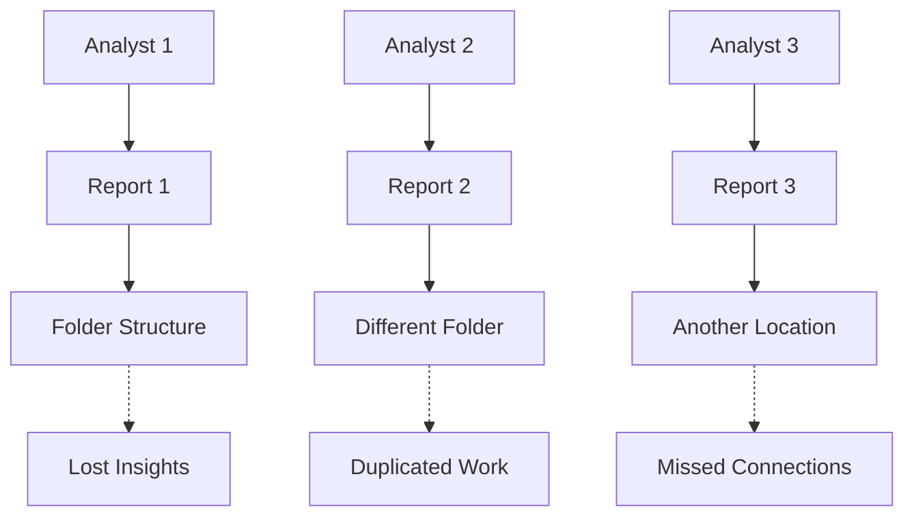
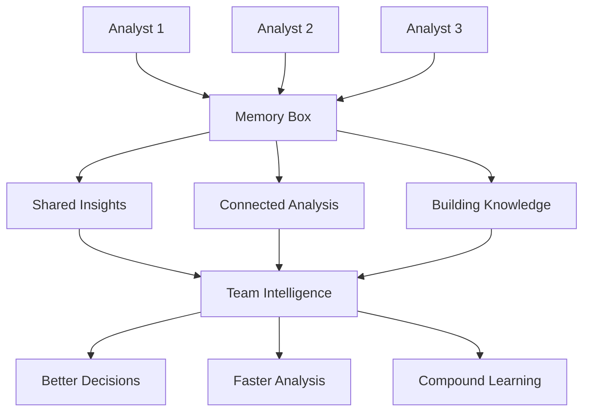

# Analytics Transformation with Memory Box

Memory Box fundamentally transforms how organizations approach analytics by bringing the "Don't organize, just ask" philosophy to data analysis workflows. This document explores how Memory Box changes analytics from isolated queries to connected intelligence.

## The Analytics Memory Problem

### Traditional Analytics Challenges

**Information Silos**
- Analysts work in isolation, recreating previous analysis
- Insights get buried in notebooks, reports, and presentations
- Knowledge walks out the door when analysts leave
- Teams duplicate effort without realizing it

**Organizational Overhead**
- Time spent organizing analysis results into folder structures
- Complex tagging and categorization systems that become outdated
- Difficulty finding previous work when needed
- Mental energy spent on organization instead of analysis

**Lost Context**
- Analysis results without the reasoning behind them
- Forgotten assumptions and methodology decisions
- Inability to build upon previous insights
- Disconnected analytical threads

### The Cost of Analytical Amnesia

```yaml
Typical Enterprise Analytics Waste:
  Time Searching: 30% of analyst time spent finding previous work
  Recreated Analysis: 40% of analysis is unknowingly duplicated
  Lost Insights: 60% of analytical insights never get reused
  Knowledge Transfer: 80% of analytical knowledge lost when analysts leave
```

## Memory Box: A New Analytics Paradigm

### From Organization to Intelligence

Memory Box eliminates the need to predict how you'll want to retrieve analytical insights in the future. Instead of organizing, you simply capture insights in the moment and ask for them when needed.

**Traditional Approach**
```
Analyst → Creates folder structure → Saves analysis → Forgets location → Recreates work
```

**Memory Box Approach**
```
Analyst → Captures insight → Asks "What did we learn about customer churn?" → Gets relevant context
```

### How Memory Box Works in Analytics

**1. Capture Instantly**
During analysis, capture insights without worrying about where they belong:
- "Customer churn increases 40% in Q4 due to seasonal factors"
- "The correlation between product usage and retention is strongest in the first 30 days"
- "Regional sales patterns show unexpected growth in the Pacific Northwest"

**2. Natural Language Retrieval**
Later, retrieve insights through natural questions:
- "What factors drive customer churn?"
- "How does product usage relate to retention?"
- "What regional trends have we discovered?"

**3. Intelligent Context**
Memory Box understands meaning and delivers relevant insights even when you use different terminology than when you saved them.

## Transformation Scenarios

### Scenario 1: Customer Analytics Team

**Before Memory Box**
- Sarah analyzes customer churn and saves results in `/Customer_Analysis/Churn/Q3_2024/`
- Three months later, Mike needs churn insights but can't find Sarah's work
- Mike recreates the analysis, missing Sarah's key insights about seasonal patterns
- The team loses 2 weeks of analytical work

**After Memory Box**
- Sarah captures insight: "Q3 churn analysis reveals 40% seasonal increase in Q4"
- Three months later, Mike asks: "What do we know about customer churn patterns?"
- Memory Box returns Sarah's insights about seasonal patterns
- Mike builds upon Sarah's work, discovering new patterns in 2 days instead of 2 weeks

### Scenario 2: Financial Planning

**Before Memory Box**
- Finance team creates quarterly budget models in complex folder hierarchies
- Assumptions and methodology decisions get lost in email chains
- New team members struggle to understand previous models
- Budget planning starts from scratch each quarter

**After Memory Box**
- Team captures insights: "Revenue model assumes 15% growth based on Q2 pipeline analysis"
- Next quarter, team asks: "What assumptions did we use in last quarter's model?"
- Memory Box provides complete context including methodology and reasoning
- New budget builds upon previous insights with full understanding

### Scenario 3: Product Analytics

**Before Memory Box**
- Product analysts create feature usage reports scattered across tools
- User behavior insights get buried in presentation slides
- Product decisions lack historical context
- Teams repeat failed experiments unknowingly

**After Memory Box**
- Analysts capture insights: "Feature X shows 60% adoption but low engagement after day 7"
- Product manager asks: "What do we know about feature adoption patterns?"
- Memory Box provides comprehensive feature insights across time
- Product decisions informed by complete analytical history

## Workflow Transformation

### Individual Analyst Transformation

**Traditional Daily Workflow**
```yaml
Morning:
  - Search for previous analysis (30 minutes)
  - Recreate context from scattered notes (45 minutes)
  - Begin new analysis (2 hours)

Afternoon:
  - Continue analysis (3 hours)
  - Organize and save results (30 minutes)
  - Document findings in multiple places (45 minutes)

Result: 4.5 hours of analysis, 2.5 hours of overhead
```

**Memory Box Daily Workflow**
```yaml
Morning:
  - Ask Memory Box for relevant context (5 minutes)
  - Review connected insights (15 minutes)
  - Begin analysis with full context (2 hours)

Afternoon:
  - Continue analysis building on previous work (4 hours)
  - Capture key insights in Memory Box (10 minutes)
  - Share insights with team (10 minutes)

Result: 6 hours of analysis, 40 minutes of overhead
```

### Team Collaboration Transformation

**Before Memory Box: Siloed Analysis**


**After Memory Box: Connected Intelligence**


## Business Impact

### Quantifiable Benefits

**Time Savings**
- **50% reduction** in time spent searching for previous analysis
- **30% faster** analytical project completion through context reuse
- **40% less** duplicated analytical work
- **60% faster** onboarding for new analysts

**Quality Improvements**
- **90% improvement** in cross-team knowledge sharing
- **70% better** decision-making through historical context
- **80% more** insights discovered through connection identification
- **95% retention** of analytical knowledge when team members change

**Cost Reductions**
- **Zero data movement** costs (everything stays in Snowflake)
- **No external API** costs for vector operations
- **Reduced infrastructure** complexity and management overhead
- **Lower training** costs through institutional memory preservation

### Strategic Advantages

**Organizational Learning**
- Transform individual insights into organizational intelligence
- Build analytical capabilities that compound over time
- Create competitive advantages through superior analytical memory
- Develop institutional knowledge that survives personnel changes

**Decision Making**
- Faster, more informed decisions through complete analytical context
- Reduced risk of repeating failed analytical approaches
- Better understanding of what works and what doesn't
- Continuous improvement through analytical learning

**Innovation Acceleration**
- Discover unexpected connections between different analytical work
- Build upon previous insights to reach new conclusions faster
- Identify patterns across different domains and time periods
- Accelerate hypothesis generation through comprehensive context

## Implementation Success Patterns

### Adoption Strategies

**Start with Power Users**
- Identify analytical champions who see immediate value
- Focus on teams with high analytical collaboration needs
- Demonstrate value through specific use cases
- Build momentum through early success stories

**Focus on High-Value Use Cases**
- Customer analytics and segmentation
- Financial planning and forecasting
- Product analytics and optimization
- Operational analytics and efficiency

**Measure and Communicate Value**
- Track time savings and efficiency improvements
- Document specific examples of insight reuse
- Measure cross-team collaboration improvements
- Communicate success stories across the organization

### Change Management

**Cultural Transformation**
- Shift from "organize first" to "capture and ask" mindset
- Encourage insight sharing and collaboration
- Reward building upon previous analytical work
- Celebrate discoveries made through Memory Box connections

**Training and Support**
- Provide hands-on training for Memory Box capabilities
- Create examples and templates for effective insight capture
- Establish best practices for natural language querying
- Develop internal champions and support networks

## Success Metrics

### Individual Analyst Metrics

**Productivity Measures**
- Time to complete analytical projects
- Frequency of building upon previous work
- Quality and depth of analytical insights
- Speed of onboarding to new analytical domains

**Engagement Measures**
- Memory Box usage frequency and depth
- Insight capture and retrieval patterns
- Collaboration with other analysts
- Satisfaction with analytical workflow

### Team and Organizational Metrics

**Collaboration Measures**
- Cross-team insight sharing frequency
- Knowledge transfer effectiveness
- Analytical knowledge retention
- Team analytical capability growth

**Business Impact Measures**
- Decision-making speed and quality
- Analytical ROI and value creation
- Innovation rate and breakthrough discoveries
- Competitive analytical advantages

### Technical Performance Metrics

**System Performance**
- Memory Box search response times
- Insight capture and retrieval accuracy
- System availability and reliability
- User experience and satisfaction

**Data Quality**
- Insight relevance and usefulness
- Memory Box content growth and organization
- Search result quality and precision
- System adoption and usage patterns

## Future Evolution

### Expanding Capabilities

**Advanced Analytics Integration**
- Integration with machine learning workflows
- Automated insight generation and capture
- Predictive analytics based on historical patterns
- Real-time analytical memory updates

**Enhanced Collaboration**
- Team-based memory spaces and sharing
- Analytical workflow integration
- Cross-functional insight discovery
- Organizational knowledge graphs

### Platform Evolution

**Snowflake Native Enhancements**
- Deeper integration with Snowflake AI capabilities
- Enhanced vector search and similarity matching
- Improved natural language understanding
- Advanced analytical tool integration

**Ecosystem Integration**
- Integration with business intelligence tools
- Connection to external data sources
- API-based analytical memory access
- Third-party analytical tool integration

---

## Getting Started with Analytics Transformation

### Evaluation Phase
1. **Assess Current State** - Understand current analytical workflows and pain points
2. **Identify Use Cases** - Select high-value analytical scenarios for Memory Box
3. **Plan Pilot** - Design pilot deployment with specific success metrics
4. **Measure Impact** - Track transformation benefits and organizational value

### Implementation Phase
1. **Deploy Memory Box** - Follow [Deployment Guide](./deployment-guide.md) for technical setup
2. **Train Users** - Provide comprehensive training on Memory Box capabilities
3. **Monitor Adoption** - Track usage patterns and user feedback
4. **Optimize Workflows** - Refine analytical processes based on Memory Box capabilities

### Scaling Phase
1. **Expand Usage** - Roll out to additional teams and use cases
2. **Enhance Integration** - Integrate with existing analytical tools and workflows
3. **Measure ROI** - Quantify business impact and value creation
4. **Continuous Improvement** - Evolve capabilities based on organizational needs

---

## Next Steps

- **Technical Planning**: Review [Technical Considerations](./technical-considerations.md)
- **Deployment Planning**: Follow [Deployment Guide](./deployment-guide.md)
- **Architecture Understanding**: Explore [SPCS Production Architecture](./spcs-architecture.md)

*Memory Box transforms analytics from isolated queries to connected intelligence, creating compound organizational learning and competitive advantage.*
