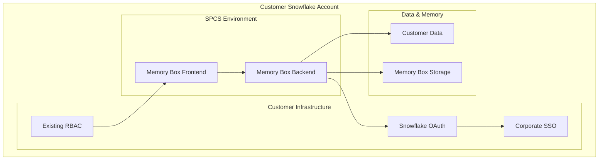
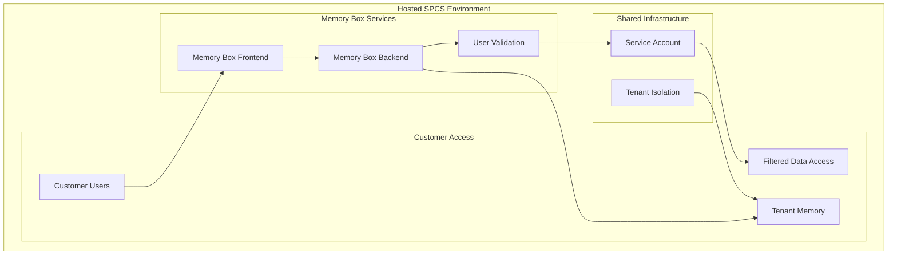
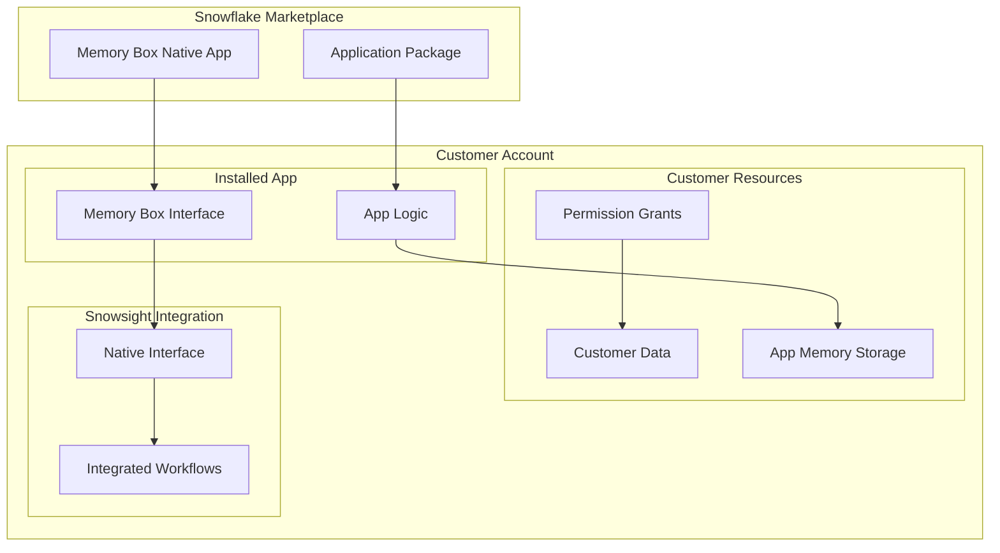

# Enterprise Deployment Models

Memory Box on Snowflake supports three enterprise deployment models, each designed for different organizational needs and security requirements. All models leverage Snowpark Container Services (SPCS) for secure, scalable deployment within your Snowflake environment.

## Overview of Deployment Models

| Model | Target Customer | Authentication | Deployment | Management | Status |
|-------|----------------|----------------|------------|------------|---------|
| **Customer Self-Deploy** | Large Enterprise | Snowflake OAuth + SSO | Customer SPCS | Customer Managed | ✅ Production Ready |
| **Managed Service** | Mid-Market | Service Account + Validation | Hosted SPCS | Professionally Managed | ✅ Production Ready |
| **Native App** | All Customers | Native App Permissions | Marketplace | Snowflake Managed | 📋 Roadmap |

## Model A: Customer Self-Deploy

### Target Profile
- **Organization Size**: Large enterprises (1000+ employees)
- **Snowflake Maturity**: Advanced users with existing governance frameworks
- **Security Requirements**: Strict data governance and compliance requirements
- **IT Resources**: Dedicated Snowflake administrators and security teams

### Key Characteristics

**Authentication & Security**
- Integrates seamlessly with your existing Snowflake OAuth infrastructure
- Leverages your corporate SSO (SAML, OIDC) for user authentication
- Inherits all existing security policies, MFA requirements, and access controls
- Complete audit trail through your existing Snowflake audit logging

**Deployment Architecture**

**Benefits**
- ✅ **Zero Additional Security Overhead** - Uses existing Snowflake authentication
- ✅ **Complete Control** - Full control over deployment, configuration, and access
- ✅ **Existing Policies** - RBAC, SSO, MFA automatically applied
- ✅ **Data Sovereignty** - All data remains in customer's Snowflake account
- ✅ **Familiar Operations** - Standard Snowflake operational procedures

**Considerations**
- Requires Snowflake administration expertise for deployment
- Customer responsible for ongoing maintenance and updates
- Requires SPCS enablement and appropriate permissions

### Implementation Overview

**Prerequisites**
- Snowflake account with SPCS enabled
- ACCOUNTADMIN privileges for initial setup
- Existing OAuth security integration (or ability to create one)
- Compute pools and image repository setup

**Deployment Process**
1. **Infrastructure Setup** - Create compute pools and image repositories
2. **Security Configuration** - Configure OAuth integration with existing SSO
3. **Container Deployment** - Deploy Memory Box services to SPCS
4. **Access Configuration** - Set up user access through existing RBAC
5. **Validation** - Test functionality with representative users and data

## Model B: Managed Service

### Target Profile
- **Organization Size**: Mid-market companies (100-1000 employees)
- **Snowflake Maturity**: Growing Snowflake usage with limited admin resources
- **Security Requirements**: Standard enterprise security with some compliance needs
- **IT Resources**: Limited Snowflake administration capacity

### Key Characteristics

**Authentication & Security**
- Professional security management with user validation layer
- Service account-based access to shared analytics environment
- User authentication through secure validation mechanisms
- Multi-tenant security with complete tenant isolation

**Deployment Architecture**

**Benefits**
- ✅ **Simplified Deployment** - No SPCS setup or management required
- ✅ **Professional Security** - Expert security management and monitoring
- ✅ **Predictable Costs** - Subscription-based pricing model
- ✅ **Rapid Time-to-Value** - Immediate access to Memory Box capabilities
- ✅ **Ongoing Support** - Professional maintenance and optimization

**Considerations**
- Shared environment with tenant isolation
- Less control over infrastructure configuration
- Dependency on service provider for updates and maintenance

### Implementation Overview

**Prerequisites**
- Snowflake account with access to shared analytics data
- User directory for authentication validation
- Data sharing agreements for analytics environment

**Deployment Process**
1. **Account Setup** - Configure access to hosted Memory Box environment
2. **User Validation** - Set up user authentication and validation
3. **Data Scope Configuration** - Define accessible data and permissions
4. **Tenant Isolation** - Configure secure multi-tenant access
5. **User Onboarding** - Train users on Memory Box capabilities

## Model C: Native App (Future)

### Target Profile
- **Organization Size**: All Snowflake customers (SMB to Enterprise)
- **Snowflake Maturity**: Any level of Snowflake experience
- **Security Requirements**: Varies by customer size and industry
- **IT Resources**: Minimal to extensive

### Key Characteristics

**Authentication & Security**
- Native Snowflake app permissions model
- Granular permission grants for database and schema access
- Customer controls all data access through standard Snowflake mechanisms
- Seamless integration with Snowsight interface

**Deployment Architecture**

**Benefits**
- ✅ **One-Click Install** - Install directly from Snowflake Marketplace
- ✅ **Automatic Updates** - Seamless version updates through Snowflake
- ✅ **Native Integration** - Built into Snowsight interface
- ✅ **Granular Permissions** - Customer controls all data access
- ✅ **Marketplace Distribution** - Easy discovery and installation

**Considerations**
- Currently in development roadmap
- Limited customization compared to self-deploy model
- Dependent on Snowflake's native app platform capabilities

## Choosing the Right Model

### Decision Framework

**Choose Customer Self-Deploy if:**
- Large enterprise with dedicated Snowflake team
- Strict security and compliance requirements
- Need full control over deployment and configuration
- Have existing Snowflake OAuth and SSO infrastructure
- Want to leverage existing operational procedures

**Choose Managed Service if:**
- Mid-market organization with limited Snowflake admin resources
- Want rapid deployment without infrastructure management
- Prefer predictable subscription-based pricing
- Need professional security management and support
- Want to focus on analytics rather than platform management

**Choose Native App (when available) if:**
- Want simplest possible installation and management
- Prefer marketplace-based software distribution
- Need seamless Snowsight integration
- Want automatic updates and platform evolution
- Have standard security requirements

### Migration Paths

**Managed Service → Customer Self-Deploy**
Organizations can start with Managed Service for rapid value realization, then migrate to Customer Self-Deploy as their Snowflake expertise grows.

**Native App → Customer Self-Deploy**
Future Native App users can migrate to Customer Self-Deploy for enhanced control and customization.

## Security Considerations

### Data Security
All deployment models ensure:
- Memory Box data never leaves your Snowflake environment
- Encryption at rest and in transit through Snowflake's native capabilities
- Access controls through Snowflake's proven RBAC system
- Complete audit trails for compliance and governance

### Authentication Security
Each model provides enterprise-grade authentication:
- **Customer Self-Deploy**: Leverages existing enterprise SSO and OAuth
- **Managed Service**: Professional security management with validation
- **Native App**: Native Snowflake app security model

### Compliance
All models inherit Snowflake's compliance certifications:
- SOC 2 Type II
- HIPAA (where applicable)
- GDPR compliance capabilities
- FedRAMP (Government Cloud)

## Getting Started

### Evaluation Process
1. **Assess Requirements** - Review security, compliance, and operational needs
2. **Evaluate Models** - Compare deployment models against requirements
3. **Pilot Planning** - Design pilot deployment with representative use cases
4. **Success Metrics** - Define success criteria and measurement approaches

### Next Steps
- **Technical Architecture**: Review [SPCS Production Architecture](./spcs-architecture.md)
- **Deployment Planning**: Follow the [Deployment Guide](./deployment-guide.md)
- **Technical Considerations**: Explore [Technical Considerations](./technical-considerations.md)

---

*Choose the deployment model that best fits your organization's security, operational, and strategic requirements.*
