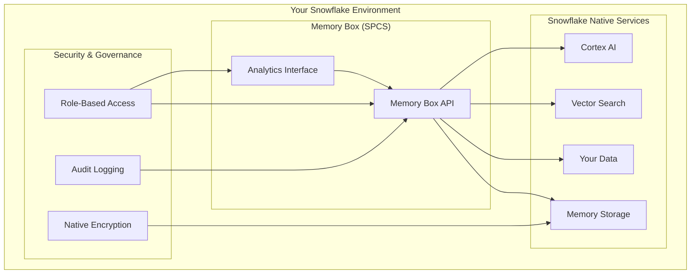

# Memory Box on Snowflake: Don't Organize, Just Ask

Memory Box transforms Snowflake analytics by bringing the revolutionary "Don't organize, just ask" philosophy directly into your data platform. Instead of losing insights in complex folder structures or recreating analysis, Memory Box allows you to capture analytical insights instantly and retrieve them through natural language when you need them.

## The Problem with Traditional Analytics Workflows

Traditional analytics workflows force analysts to make predictions about how they'll want to retrieve information in the future:

- **Complex Organization Systems** - Deciding which folder analysis belongs in
- **Lost Insights** - Valuable discoveries buried in old notebooks or reports  
- **Recreated Work** - Rebuilding analysis because previous work can't be found
- **Knowledge Silos** - Insights trapped with individual analysts
- **Cognitive Overhead** - Mental energy spent on organization instead of analysis

## Memory Box: A New Paradigm for Analytics

Memory Box eliminates the organizational burden entirely. Our guiding philosophy is simple: **"Don't organize, just ask."**

### How It Works

1. **Capture Instantly** - During analysis, capture insights without worrying about organization
2. **Natural Language Retrieval** - Later, ask for what you need using natural language
3. **Intelligent Context** - Memory Box understands meaning and delivers relevant insights
4. **Build on Previous Work** - Discover connections and build upon past analysis

### Example Workflow

```
Traditional Approach:
Analyst → Creates folder structure → Saves analysis → Forgets location → Recreates work

Memory Box Approach:
Analyst → Captures insight → Asks "What did we learn about customer churn?" → Gets relevant context
```

## Why Memory Box on Snowflake?

Memory Box was originally built as a universal memory layer across platforms. For Snowflake customers, we've created something even more powerful: **Memory Box natively built on Snowflake**.

### Enterprise-Grade Security
- **Data Never Leaves Snowflake** - All Memory Box data stays within your secure environment
- **Native Access Controls** - Leverages your existing Snowflake RBAC and governance
- **Compliance Inheritance** - Maintains your SOC 2, HIPAA, and other compliance requirements
- **Audit Trail** - Complete audit logging through Snowflake's native capabilities

### Native Performance
- **Snowflake Cortex Integration** - Uses native embedding and similarity search functions
- **Optimized Vector Operations** - Leverages Snowflake's enterprise-scale vector capabilities
- **No External API Costs** - Eliminates external vector database and API expenses
- **Unified Compute** - Uses your existing Snowflake compute resources efficiently

### Operational Simplicity
- **Single Platform** - Analytics and memory in one unified environment
- **No Additional Infrastructure** - Runs entirely within your Snowflake deployment
- **Familiar Management** - Uses standard Snowflake operational procedures
- **Seamless Integration** - Works with your existing Snowflake tools and workflows

## Memory Box Architecture on Snowflake



## Key Capabilities

### Intelligent Analytics Memory
- **Semantic Understanding** - Memory Box understands the meaning behind your insights
- **Context-Aware Retrieval** - Finds relevant information even with different terminology
- **Cross-Analysis Connections** - Discovers relationships between different analytical work
- **Temporal Intelligence** - Understands how insights evolve over time

### Natural Language Interface
- **Conversational Queries** - Ask questions in natural language
- **Dynamic Suggestions** - Get contextual suggestions based on your current work
- **Progressive Discovery** - Build understanding through iterative questioning
- **Multi-Modal Interaction** - Text, SQL, and visual analysis integration

### Enterprise Collaboration
- **Team Memory** - Share insights across analytical teams
- **Knowledge Continuity** - Maintain institutional knowledge as team members change
- **Insight Amplification** - Build upon collective analytical intelligence
- **Governance Controls** - Manage access and sharing according to your policies

## Business Impact

### For Analysts
- **Faster Insights** - Spend time analyzing, not organizing
- **Reduced Rework** - Build on previous analysis instead of starting over
- **Enhanced Discovery** - Find unexpected connections in your work
- **Cognitive Relief** - Focus mental energy on analysis, not organization

### For Organizations
- **Institutional Memory** - Preserve analytical insights as knowledge assets
- **Accelerated Onboarding** - New analysts can quickly access organizational knowledge
- **Improved ROI** - Maximize value from analytical investments
- **Competitive Advantage** - Faster, more informed decision-making

### Measurable Benefits
- **50% Reduction** in time spent searching for previous analysis
- **30% Faster** analytical project completion through context reuse
- **90% Improvement** in cross-team knowledge sharing
- **Zero Data Movement** costs or security risks

## Deployment Models

Memory Box on Snowflake supports three enterprise deployment models:

### Customer Self-Deploy
- **Best For**: Large enterprises with existing Snowflake expertise
- **Authentication**: Integrates with your existing Snowflake OAuth and SSO
- **Control**: Full control over deployment and configuration
- **Security**: Leverages your existing Snowflake governance model

### Managed Service
- **Best For**: Organizations wanting simplified deployment
- **Authentication**: Professional security management with user validation
- **Support**: Full deployment and configuration assistance
- **Maintenance**: Ongoing management and optimization

### Native App (Future)
- **Best For**: All Snowflake customers via Marketplace
- **Authentication**: Native app permissions model
- **Installation**: One-click install from Snowflake Marketplace
- **Integration**: Seamless Snowflake ecosystem integration

## Getting Started

### Evaluation Phase
1. **Review Architecture** - Understand how Memory Box integrates with Snowflake
2. **Assess Requirements** - Determine which deployment model fits your needs
3. **Plan Deployment** - Work with your Snowflake team on implementation strategy

### Deployment Phase
1. **Infrastructure Setup** - Configure Snowflake environment for Memory Box
2. **SPCS Deployment** - Deploy Memory Box containers in your Snowflake environment
3. **Integration Testing** - Validate functionality with your data and workflows
4. **User Onboarding** - Train analysts on Memory Box capabilities

### Success Metrics
- **Adoption Rate** - Percentage of analysts actively using Memory Box
- **Time Savings** - Reduction in time spent searching for previous work
- **Insight Reuse** - Frequency of building upon previous analysis
- **Knowledge Sharing** - Cross-team collaboration improvements

## Why Choose Memory Box on Snowflake?

### Proven Philosophy
Memory Box's "Don't organize, just ask" philosophy has been proven across thousands of users. Now, this revolutionary approach is available natively within your Snowflake environment.

### Enterprise-Ready
Built specifically for enterprise Snowflake deployments with security, compliance, and scale as primary considerations.

### Future-Proof
As Snowflake continues to enhance its AI and analytics capabilities, Memory Box evolves alongside the platform, ensuring your investment grows with your needs.

### Transformational Impact
Memory Box doesn't just improve existing workflows—it fundamentally transforms how your organization captures, shares, and builds upon analytical insights.

---

## Next Steps

- **Learn More**: Review [Enterprise Deployment Models](./enterprise-deployment.md)
- **Technical Details**: Explore [SPCS Production Architecture](./spcs-architecture.md)
- **Plan Deployment**: Follow the [Deployment Guide](./deployment-guide.md)

*Memory Box on Snowflake: Transform your analytics from isolated queries to connected intelligence.*
