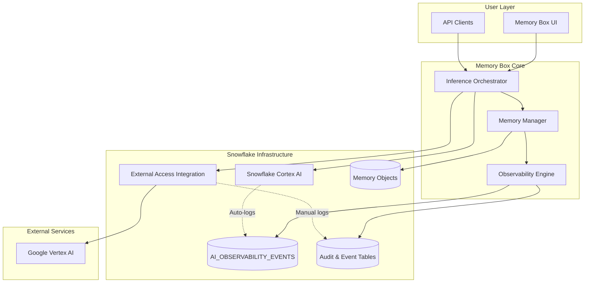
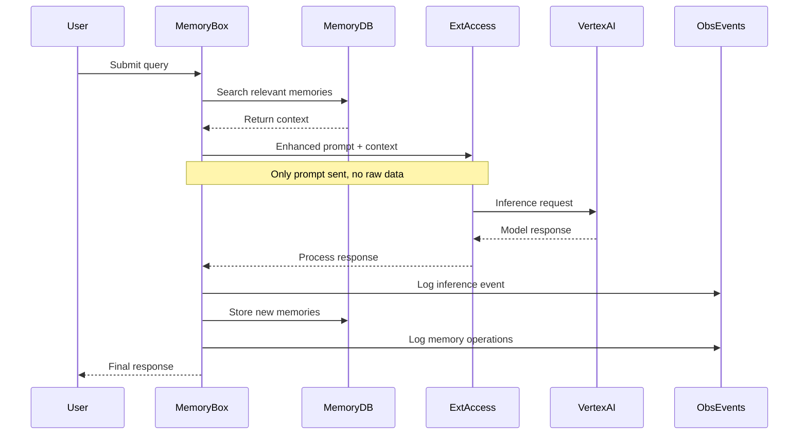

# Enterprise AI Observability & External Inference Integration

*Complete auditability, multi-model inference, and memory intelligence with Snowflake data residency*

---

## Executive Overview

This specification defines the architecture for extending Memory Box on Snowflake with comprehensive observability, external AI model inference (Google Vertex AI), and enterprise-grade auditability capabilities. The solution enables organizations to leverage best-of-breed AI models while maintaining complete data governance, regulatory compliance, and cost transparency—all within Snowflake's secure infrastructure.

### Value Proposition

**For Financial Services and Regulated Industries:**
- ✅ **Complete Data Residency** - All enterprise data, memory objects, and audit logs remain within Snowflake
- ✅ **Multi-Model Flexibility** - Access Google Vertex AI models alongside Snowflake Cortex without data egress
- ✅ **Full Observability** - Every inference request, memory operation, and system action is logged and auditable
- ✅ **Regulatory Compliance** - Native GDPR and SOC 2 compliance with right-to-be-forgotten capabilities
- ✅ **Cost Transparency** - Granular attribution and optimization across internal and external AI services

### Key Differentiators

1. **Native Snowflake Integration** - Leverages Snowflake's AI_OBSERVABILITY_EVENTS, External Access Integrations, and native security
2. **Memory Intelligence** - Semantic memory with full lifecycle tracking and behavioral analytics
3. **External Inference Gateway** - Secure API gateway for external models with complete audit trail
4. **Unified Observability** - Single platform for monitoring Snowflake Cortex and external AI operations
5. **Compliance-First Design** - Built-in GDPR and SOC 2 controls from the ground up

---

## Snowflake AI Observability: Foundation

Memory Box's observability layer is built on **Snowflake AI Observability**, a production-ready feature that provides comprehensive monitoring, evaluation, and tracing capabilities for generative AI applications. Released as generally available in January 2025, Snowflake AI Observability operates on three core pillars:

### Three Pillars of AI Observability

#### 1. Tracing
**Purpose:** Visualize inputs, outputs, and intermediate states for debugging and explainability.

Snowflake AI Observability uses **OpenTelemetry standards** to capture distributed traces across:
- LLM inference calls (both Snowflake Cortex and external models)
- RAG pipeline operations (retrieval, augmentation, generation)
- Agent executions (planning, tool use, response synthesis)
- Memory operations (search, storage, retrieval)

**Memory Box Integration:** Every inference request, memory search, and user interaction generates a complete trace with:
- Unique trace IDs for end-to-end tracking
- Span hierarchies showing operation dependencies
- Timing information for performance analysis
- Success/failure status for reliability metrics

#### 2. Evaluation
**Purpose:** Systematically assess AI application quality using LLM-as-a-judge and custom metrics.

Snowflake provides built-in evaluation functions:
- **Relevance scoring:** How well responses match user queries
- **Groundedness assessment:** Factual accuracy based on retrieved context
- **Harmfulness detection:** Identifying unsafe or inappropriate content
- **Context relevance:** Quality of RAG retrieval results

**Memory Box Enhancement:** Extends evaluation to memory effectiveness:
- Memory utilization rates (how often memories are accessed)
- Context relevance scores (how well memories match queries)
- Memory decay analysis (identifying stale or unused memories)
- Behavioral pattern accuracy (validating learned preferences)

#### 3. Monitoring
**Purpose:** Continuously track operational metrics for performance optimization.

Real-time monitoring covers:
- Response latency (p50, p95, p99 percentiles)
- Token consumption and costs
- Error rates and failure patterns
- Throughput and concurrency metrics

**Memory Box Contribution:** Adds memory-specific monitoring:
- Memory search performance
- Vector similarity score distributions
- Memory storage growth rates
- Cost attribution per user/session

### The AI_OBSERVABILITY_EVENTS Table

At the heart of Snowflake's observability is the **`SNOWFLAKE.LOCAL.AI_OBSERVABILITY_EVENTS`** table—a special system table that:

- **Auto-populates** for all Snowflake Cortex AI operations
- **Supports manual logging** for external AI operations (like Vertex AI)
- **Uses OpenTelemetry format** for industry-standard compatibility
- **Enables SQL-based analysis** of all AI operations
- **Persists indefinitely** with no automatic cleanup (compliance-ready)
- **Provides immutability** (entries cannot be modified after creation)

**Data Model:**
```
Trace → Spans → Events → Metrics
  ↓
Resources (warehouses, users, services)
  ↓
Attributes (custom metadata)
```

This hierarchical structure allows querying at any level:
- High-level trace analysis for request-to-response flows
- Mid-level span analysis for operation breakdowns
- Low-level event analysis for debugging specific steps

---

## Design Methodology

### Dual-Layer Observability Pattern

Memory Box employs a **dual-layer observability architecture** that combines Snowflake's native capabilities with Memory Box-specific tracking:

**Layer 1: Snowflake Native (AI_OBSERVABILITY_EVENTS)**
- Automatic instrumentation for Cortex AI operations
- OpenTelemetry-compliant distributed tracing
- Native integration with Snowflake monitoring tools
- No-code observability for standard AI operations

**Layer 2: Memory Box Custom (memory_box_events)**
- Extended tracking for memory lifecycle
- User behavioral analytics
- External API call logging (Vertex AI)
- Cost attribution and budget management
- Compliance-specific audit trails

**Benefits of Dual-Layer Approach:**
1. **Comprehensive Coverage:** Every operation logged in at least one system
2. **Unified Analysis:** SQL joins between layers for complete picture
3. **Standards Compliance:** OpenTelemetry format enables tool integration
4. **Flexibility:** Custom events for domain-specific requirements
5. **Performance:** Optimized schemas for specific query patterns

### External Inference Gateway Pattern

The Vertex AI integration follows a **secure gateway pattern** that:

**Minimizes Data Egress:**
- Only prompt and selected context leave Snowflake
- No raw data tables or sensitive fields transmitted
- Response immediately captured and stored internally

**Maintains Audit Trail:**
- Every external API call logged with complete metadata
- Request/response payloads captured (configurable retention)
- Cost tracking integrated into unified platform
- Trace continuity across Snowflake ↔ Vertex AI boundary

**Enables Multi-Model Strategy:**
- Abstracted interface supports multiple providers
- Cost comparison across Snowflake Cortex vs. Vertex AI
- A/B testing different models for same queries
- Graceful fallback if external service unavailable

### Memory-Enhanced Context Pattern

Memory Box's semantic memory system follows a **context augmentation pattern**:

**Storage:** Memories stored as text + vector embeddings (768 dimensions)
**Retrieval:** Vector similarity search finds relevant context
**Augmentation:** Retrieved memories prepended to user prompts
**Learning:** Response and interaction stored as new memories
**Optimization:** Access patterns improve future retrievals

**Key Design Decisions:**
1. **Snowflake-Native Vectors:** Uses `VECTOR(FLOAT, 768)` data type with native similarity functions
2. **Session-Aware:** Memories scoped to user/session with optional global sharing
3. **Type Classification:** Memories categorized (preference, interaction, insight, fact)
4. **Lifecycle Management:** Automatic expiration and retention policies
5. **Compliance-Ready:** Deletion workflows preserve audit trails

---

## Enterprise Use Cases

### Use Case 1: Regulatory Audit Trail for AI-Powered Trading Alerts

**Scenario:** A financial institution uses AI to generate trading alerts based on market data analysis.

**Challenge:** Regulators require complete audit trail showing:
- What data was accessed
- What AI models were used
- How decisions were made
- Who requested each analysis

**Memory Box Solution:**
```
1. Trader queries: "Alert me about unusual volatility in tech stocks"
2. Memory Box logs:
   - User ID and session timestamp
   - Database tables accessed (market_data, volatility_indices)
   - Memory objects retrieved (past alerts, user preferences)
   - Vertex AI Gemini Pro inference request + response
   - Token consumption and cost attribution
3. All operations stored in AI_OBSERVABILITY_EVENTS with:
   - Complete trace ID for request-to-response tracking
   - Data lineage showing source tables → memories → prompt → model → alert
   - Timing information proving real-time analysis
4. Right-to-be-forgotten: If trader leaves, complete deletion with audit proof
```

**Compliance Benefits:**
- SEC/FINRA audit requirements met automatically
- Complete reconstruction of any historical decision
- Proof of data residency (nothing left Snowflake except model API call)
- Cost allocation for internal chargeback

### Use Case 2: Credit Risk Analysis with Memory Persistence

**Scenario:** Bank uses AI for credit risk assessment with learned organizational policies.

**Challenge:** 
- Credit officers have different risk tolerances
- Organizational policies evolve over time
- Must explain every credit decision
- Need to track model performance over time

**Memory Box Solution:**
```
Memory Types Stored:
- User Preferences: Officer-specific risk tolerances
- Learned Behaviors: Historical approval patterns
- Policy Updates: Organizational guideline changes
- Decision Context: Each credit assessment with full rationale

Observability Tracking:
- Memory effectiveness: Which historical decisions influenced current analysis
- Model comparison: Snowflake Cortex vs. Vertex AI accuracy
- Cost analysis: Token usage per credit assessment
- Audit trail: Complete decision lineage for regulatory review
```

**Business Value:**
- 40% reduction in credit review time (learned preferences)
- 100% audit trail coverage (compliance)
- Model performance tracking (continuous improvement)
- Fair lending compliance (explainable decisions)

### Use Case 3: Customer Service Analytics with Privacy Controls

**Scenario:** Insurance company analyzes customer service interactions for quality improvement.

**Challenge:**
- PII in customer conversations
- GDPR right-to-be-forgotten requirements
- Need to track service quality trends
- Multi-model AI strategy (cost optimization)

**Memory Box Solution:**
```
Data Flow:
1. Customer interaction ingested (call transcript, chat logs)
2. Sentiment analysis via Vertex AI
3. Key insights stored as memories (anonymized)
4. Service patterns identified over time
5. Quality metrics tracked per agent

Privacy Implementation:
- Customer PII never sent to external models
- Anonymized summaries stored in Memory Box
- GDPR deletion removes all customer data
- Audit log preserves deletion verification
- Time Travel limited to 24 hours for PII tables

Observability:
- Track which AI model performed sentiment analysis
- Cost comparison: Snowflake Cortex vs. Vertex AI
- Performance metrics: Latency, accuracy, token usage
- Quality trends: Service improvements over time
```

**Regulatory Compliance:**
- GDPR Article 17 (right to erasure) implemented
- SOC 2 audit trail for all data access
- PII handling procedures documented and enforced
- Cost transparency for budget accountability

### Use Case 4: Multi-Model Research Assistant for Quantitative Analysis

**Scenario:** Hedge fund uses AI to research market trends and investment opportunities.

**Challenge:**
- Need access to best AI models (not all in Snowflake)
- Queries span multiple data sources
- Results must be reproducible for compliance
- Researchers learn from past analyses

**Memory Box Solution:**
```
Model Strategy:
- Snowflake Cortex: Fast queries on structured data
- Vertex AI: Deep analysis of unstructured research reports
- Memory Box: Stores learned insights and patterns

Workflow:
1. Analyst: "What drove tech stock volatility last quarter?"
2. Memory Box retrieves: Past analyses on volatility
3. Snowflake Cortex: Queries structured price data
4. Vertex AI: Analyzes news articles and reports
5. Combined insights stored as new memory
6. Full trace logged for reproducibility

Observability Benefits:
- Cost tracking per analyst (budget management)
- Model performance comparison (which AI for which task)
- Response quality evaluation (groundedness, relevance)
- Research productivity metrics (time saved by memory)
```

**ROI Metrics:**
- 60% faster research (memory of past analyses)
- 30% cost reduction (optimal model selection)
- 100% reproducibility (complete trace logs)
- Improved decision quality (learned patterns)

---

## Architecture Overview

### System Components



### Data Flow: Request to Response



---

## Feature Area 1: External Inference Integration

### Overview

Enable secure inference using Google Vertex AI models while maintaining complete data residency in Snowflake. All persistent data, memory objects, and audit logs remain in Snowflake—only the constructed prompt is sent to external models.

### 1.1 External Access Integration Setup

#### Network Rules Configuration

```sql
-- Network rule for Vertex AI regional endpoints
CREATE OR REPLACE NETWORK RULE vertex_ai_network_rule
  MODE = EGRESS
  TYPE = HOST_PORT
  VALUE_LIST = (
    'us-central1-aiplatform.googleapis.com:443',
    'europe-west1-aiplatform.googleapis.com:443',
    'asia-southeast1-aiplatform.googleapis.com:443'
  )
  COMMENT = 'Network access for Vertex AI inference endpoints';
```

**Security Features:**
- Egress-only traffic (no inbound connections)
- HTTPS/TLS enforcement
- IP-level granularity
- Port restrictions (443 only)

#### Secrets Management

```sql
-- OAuth2 authentication for Vertex AI
CREATE OR REPLACE SECURITY INTEGRATION vertex_ai_oauth
  TYPE = API_AUTHENTICATION
  AUTH_TYPE = OAUTH2
  OAUTH_CLIENT_ID = 'your_client_id'
  OAUTH_CLIENT_SECRET = 'your_client_secret'
  OAUTH_TOKEN_ENDPOINT = 'https://oauth2.googleapis.com/token'
  OAUTH_AUTHORIZATION_ENDPOINT = 'https://accounts.google.com/o/oauth2/auth'
  OAUTH_SCOPE = 'https://www.googleapis.com/auth/cloud-platform'
  ENABLED = TRUE;

-- OAuth2 secret with refresh token
CREATE OR REPLACE SECRET vertex_ai_oauth_secret
  TYPE = OAUTH2
  API_AUTHENTICATION = vertex_ai_oauth
  OAUTH_REFRESH_TOKEN = 'your_refresh_token'
  COMMENT = 'OAuth2 secret for Vertex AI authentication';
```

#### External Access Integration

```sql
-- Combined integration for secure API access
CREATE OR REPLACE EXTERNAL ACCESS INTEGRATION vertex_ai_integration
  ALLOWED_NETWORK_RULES = (vertex_ai_network_rule)
  ALLOWED_AUTHENTICATION_SECRETS = (vertex_ai_oauth_secret)
  ENABLED = TRUE
  COMMENT = 'Integration for secure Vertex AI API access from Memory Box';

-- Grant privileges
GRANT USAGE ON INTEGRATION vertex_ai_integration TO ROLE memory_box_service_account;
GRANT READ ON SECRET vertex_ai_oauth_secret TO ROLE memory_box_service_account;
```

### 1.2 Python Stored Procedures for Inference

#### Memory-Enhanced Inference Procedure

```python
CREATE OR REPLACE PROCEDURE memory_box_vertex_inference(
  session_id STRING,
  user_id STRING, 
  prompt STRING,
  context_limit INTEGER DEFAULT 5
)
RETURNS OBJECT
LANGUAGE PYTHON
RUNTIME_VERSION = '3.11'
HANDLER = 'execute_vertex_inference'
EXTERNAL_ACCESS_INTEGRATIONS = (vertex_ai_integration)
PACKAGES = ('snowflake-snowpark-python', 'requests', 'json')
SECRETS = ('oauth_cred' = vertex_ai_oauth_secret)
AS $$

import _snowflake
import requests
import json
import uuid
from datetime import datetime

def execute_vertex_inference(session, session_id, user_id, prompt, context_limit):
    """
    Execute Vertex AI inference with complete Memory Box integration
    """
    trace_id = str(uuid.uuid4())
    start_time = datetime.utcnow()
    
    try:
        # Step 1: Memory Context Retrieval
        relevant_memories = retrieve_memory_context(
            session, user_id, session_id, prompt, context_limit, trace_id
        )
        
        # Step 2: Construct Enhanced Prompt
        enhanced_prompt = construct_enhanced_prompt(prompt, relevant_memories)
        
        # Step 3: Execute Vertex AI Inference
        vertex_response = call_vertex_ai_api(enhanced_prompt, trace_id)
        
        # Step 4: Process and Store Response
        processed_response = process_vertex_response(vertex_response, trace_id)
        
        # Step 5: Update Memory Objects
        memory_updates = update_memory_objects(
            session, user_id, session_id, prompt, processed_response, trace_id
        )
        
        # Step 6: Log Complete Transaction
        log_inference_transaction(
            session, user_id, session_id, prompt, enhanced_prompt, 
            vertex_response, processed_response, memory_updates, trace_id, start_time
        )
        
        return {
            'response': processed_response,
            'trace_id': trace_id,
            'memory_updates': memory_updates,
            'timestamp': start_time.isoformat()
        }
        
    except Exception as e:
        log_error_event(session, user_id, session_id, str(e), trace_id, start_time)
        return {
            'error': str(e),
            'trace_id': trace_id,
            'timestamp': start_time.isoformat()
        }

def call_vertex_ai_api(enhanced_prompt, trace_id):
    """
    Make authenticated API call to Vertex AI with comprehensive error handling
    """
    # Get OAuth token
    access_token = _snowflake.get_oauth_access_token('oauth_cred')
    
    vertex_endpoint = "https://us-central1-aiplatform.googleapis.com/v1/projects/PROJECT_ID/locations/us-central1/publishers/google/models/gemini-pro:predict"
    
    headers = {
        'Authorization': f'Bearer {access_token}',
        'Content-Type': 'application/json',
        'X-Trace-Id': trace_id
    }
    
    payload = {
        'instances': [{
            'prompt': enhanced_prompt,
            'parameters': {
                'temperature': 0.7,
                'max_output_tokens': 1024,
                'top_p': 0.9
            }
        }]
    }
    
    # Execute with retry logic
    max_retries = 3
    for attempt in range(max_retries):
        try:
            response = requests.post(
                vertex_endpoint,
                headers=headers,
                json=payload,
                timeout=30
            )
            
            if response.status_code == 200:
                return {
                    'status': 'success',
                    'response': response.json(),
                    'attempt': attempt + 1,
                    'latency_ms': response.elapsed.total_seconds() * 1000
                }
            elif attempt == max_retries - 1:
                raise Exception(f"Vertex AI API error: {response.status_code}")
                    
        except requests.exceptions.Timeout:
            if attempt == max_retries - 1:
                raise Exception("Vertex AI API timeout")
                
$$;
```

### 1.3 Data Residency Guarantees

**What Stays in Snowflake:**
- ✅ All source data tables and databases
- ✅ Memory objects and vector embeddings
- ✅ User sessions and behavioral data
- ✅ Complete audit logs and event traces
- ✅ Cost attribution and usage metrics

**What Leaves Snowflake:**
- ❌ Only: Constructed prompt + selected context for inference
- ❌ Duration: Single request/response cycle only
- ❌ Storage: No data persisted outside Snowflake

---

## Feature Area 2: AI Observability Framework

### Overview

Comprehensive observability for all AI operations using Snowflake's native AI_OBSERVABILITY_EVENTS table combined with Memory Box-specific event tracking.

### 2.1 Snowflake Native Observability Integration

#### AI_OBSERVABILITY_EVENTS Structure

```sql
-- Standard Snowflake AI observability table (managed by Snowflake)
SNOWFLAKE.LOCAL.AI_OBSERVABILITY_EVENTS (
  TIMESTAMP TIMESTAMP_NTZ,           -- Event completion time
  START_TIMESTAMP TIMESTAMP_NTZ,     -- Event start time
  OBSERVED_TIMESTAMP TIMESTAMP_NTZ,  -- Log observation time
  TRACE OBJECT,                      -- OpenTelemetry trace context
  SPAN OBJECT,                       -- Span information
  RESOURCE OBJECT,                   -- Resource identification
  SCOPE OBJECT,                      -- Event scope/namespace
  RECORD_TYPE STRING,                -- 'LOG', 'SPAN', 'SPAN_EVENT', 'METRIC'
  RECORD OBJECT,                     -- Record-specific data
  RECORD_ATTRIBUTES OBJECT,          -- Additional metadata
  VALUE VARIANT,                     -- Primary event value
  RESOURCE_ATTRIBUTES OBJECT         -- Snowflake resource context
);
```

**Features:**
- OpenTelemetry-compliant structure
- Automatic population for Snowflake Cortex operations
- Manual logging capability for external operations
- Distributed tracing support

### 2.2 Memory Box Event Tables

#### Comprehensive Event Schema

```sql
CREATE OR REPLACE TABLE memory_box_events (
  event_id STRING PRIMARY KEY,
  user_id STRING NOT NULL,
  session_id STRING,
  event_type STRING NOT NULL,
  -- Event types: 'memory_create', 'memory_search', 'inference_request', 
  --              'memory_delete', 'external_api_call', 'cost_event'
  
  event_data OBJECT NOT NULL,        -- Event-specific payload
  trace_id STRING,                   -- Distributed trace ID
  span_id STRING,                    -- Current span ID
  parent_span_id STRING,             -- Parent span for hierarchy
  
  timestamp TIMESTAMP_NTZ NOT NULL,
  duration_ms INTEGER,
  event_status STRING DEFAULT 'success',  -- 'success', 'error', 'timeout'
  error_message STRING,
  
  event_metadata OBJECT,             -- Additional context
  snowflake_query_id STRING,         -- Link to Snowflake query
  
  -- External API tracking
  external_api_provider STRING,      -- 'vertex_ai', 'claude', etc.
  external_api_model STRING,
  external_api_latency_ms INTEGER,
  tokens_consumed INTEGER,
  cost_usd DECIMAL(10,4),
  
  -- Compliance flags
  gdpr_relevant BOOLEAN DEFAULT TRUE,
  
  -- Performance
  CONSTRAINT fk_user FOREIGN KEY (user_id) REFERENCES memory_box_users(user_id)
) 
CLUSTER BY (user_id, event_type, timestamp);
```

#### Session Tracking Schema

```sql
CREATE OR REPLACE TABLE memory_box_sessions (
  session_id STRING PRIMARY KEY,
  user_id STRING NOT NULL,
  session_start_timestamp TIMESTAMP_NTZ NOT NULL,
  session_end_timestamp TIMESTAMP_NTZ,
  
  session_metadata OBJECT,           -- Device, location, app context
  memory_objects_created INTEGER DEFAULT 0,
  inference_requests_count INTEGER DEFAULT 0,
  total_tokens_consumed INTEGER DEFAULT 0,
  total_cost_usd DECIMAL(10,4) DEFAULT 0,
  
  session_status STRING DEFAULT 'active',  -- 'active', 'completed', 'expired'
  trace_id STRING,
  
  CONSTRAINT fk_user FOREIGN KEY (user_id) REFERENCES memory_box_users(user_id)
);
```

### 2.3 Event Logging Implementation

#### Comprehensive Event Logger

```python
def log_comprehensive_event(
    session, event_type, user_id, session_id, event_data, 
    trace_id, duration_ms=None, external_provider=None, 
    tokens_consumed=None, cost_usd=None, error_message=None
):
    """
    Log events to both Snowflake AI Observability and Memory Box tables
    """
    event_id = str(uuid.uuid4())
    span_id = str(uuid.uuid4())
    timestamp = datetime.utcnow()
    event_status = 'error' if error_message else 'success'
    
    # Log to Memory Box events table
    memory_box_event_query = f"""
        INSERT INTO memory_box_events (
            event_id, user_id, session_id, event_type, event_data, 
            trace_id, span_id, timestamp, duration_ms, event_status, 
            error_message, external_api_provider, tokens_consumed, cost_usd
        ) VALUES (
            '{event_id}', '{user_id}', '{session_id}', '{event_type}',
            PARSE_JSON('{json.dumps(event_data)}'), '{trace_id}', '{span_id}',
            '{timestamp.isoformat()}', {duration_ms or 'NULL'}, '{event_status}',
            {f"'{error_message}'" if error_message else 'NULL'}, 
            {f"'{external_provider}'" if external_provider else 'NULL'},
            {tokens_consumed or 'NULL'}, {cost_usd or 'NULL'}
        )
    """
    session.sql(memory_box_event_query).collect()
    
    # Log to Snowflake AI Observability for span-worthy events
    if event_type in ['inference_request', 'memory_search', 'memory_batch_operation']:
        ai_obs_query = f"""
            INSERT INTO SNOWFLAKE.LOCAL.AI_OBSERVABILITY_EVENTS (
                TIMESTAMP, START_TIMESTAMP, TRACE, RECORD_TYPE, RECORD, 
                RECORD_ATTRIBUTES, VALUE, RESOURCE_ATTRIBUTES
            ) VALUES (
                '{timestamp.isoformat()}',
                '{(timestamp - timedelta(milliseconds=duration_ms or 0)).isoformat()}',
                PARSE_JSON('{json.dumps({"trace_id": trace_id, "span_id": span_id})}'),
                'SPAN',
                PARSE_JSON('{json.dumps({"name": event_type, "kind": "CLIENT"})}'),
                PARSE_JSON('{json.dumps({
                    "memory_box.user_id": user_id,
                    "memory_box.event_type": event_type,
                    "external_api.provider": external_provider,
                    "duration_ms": duration_ms,
                    "success": event_status == "success"
                })}'),
                PARSE_JSON('{json.dumps(event_data)}'),
                PARSE_JSON('{json.dumps({
                    "snow.executable.name": "memory_box_system",
                    "snow.user.name": user_id
                })}')
            )
        """
        session.sql(ai_obs_query).collect()
```

### 2.4 Real-Time Monitoring Views

```sql
-- Inference performance monitoring
CREATE OR REPLACE VIEW memory_box_inference_metrics AS
SELECT 
    DATE_TRUNC('hour', timestamp) as hour_bucket,
    external_api_provider,
    COUNT(*) as total_requests,
    AVG(duration_ms) as avg_latency_ms,
    PERCENTILE_CONT(0.95) WITHIN GROUP (ORDER BY duration_ms) as p95_latency_ms,
    PERCENTILE_CONT(0.99) WITHIN GROUP (ORDER BY duration_ms) as p99_latency_ms,
    SUM(CASE WHEN event_status = 'error' THEN 1 ELSE 0 END) as error_count,
    (SUM(CASE WHEN event_status = 'error' THEN 1 ELSE 0 END)::FLOAT / COUNT(*)) * 100 as error_rate_pct,
    AVG(tokens_consumed) as avg_tokens_per_request,
    SUM(cost_usd) as total_cost_usd
FROM memory_box_events 
WHERE event_type = 'inference_request'
  AND timestamp >= CURRENT_TIMESTAMP - INTERVAL '7 days'
GROUP BY hour_bucket, external_api_provider
ORDER BY hour_bucket DESC;

-- Memory operations analytics
CREATE OR REPLACE VIEW memory_box_memory_metrics AS
SELECT 
    user_id,
    DATE_TRUNC('day', timestamp) as day_bucket,
    COUNT(CASE WHEN event_type = 'memory_create' THEN 1 END) as memories_created,
    COUNT(CASE WHEN event_type = 'memory_search' THEN 1 END) as memory_searches,
    COUNT(CASE WHEN event_type = 'memory_delete' THEN 1 END) as memories_deleted,
    AVG(CASE WHEN event_type = 'memory_search' THEN duration_ms END) as avg_search_latency_ms,
    SUM(CASE WHEN event_status = 'error' THEN 1 ELSE 0 END) as error_count
FROM memory_box_events 
WHERE timestamp >= CURRENT_TIMESTAMP - INTERVAL '30 days'
GROUP BY user_id, day_bucket
ORDER BY day_bucket DESC, user_id;
```

---

## Feature Area 3: Memory Observability & Management

### Overview

Complete lifecycle tracking and analytics for Memory Box semantic memory operations, enabling behavioral insights and optimization.

### 3.1 Memory Object Schema

```sql
CREATE OR REPLACE TABLE memory_box_objects (
    memory_id STRING PRIMARY KEY,
    user_id STRING NOT NULL,
    session_id STRING,
    memory_content TEXT NOT NULL,
    memory_vector VECTOR(FLOAT, 768) NOT NULL,
    
    memory_type STRING NOT NULL,
    -- Types: 'user_preference', 'interaction', 'context', 
    --        'learned_behavior', 'insight', 'fact'
    
    memory_metadata OBJECT,          -- Source, confidence, tags
    created_timestamp TIMESTAMP_NTZ NOT NULL,
    updated_timestamp TIMESTAMP_NTZ,
    accessed_count INTEGER DEFAULT 0,
    last_accessed_timestamp TIMESTAMP_NTZ,
    
    trace_id STRING,                 -- Creation trace
    source_database STRING,          -- Source data location
    source_query STRING,             -- Original query if applicable
    
    -- Compliance and lifecycle
    is_deleted BOOLEAN DEFAULT FALSE,
    deletion_timestamp TIMESTAMP_NTZ,
    deletion_reason STRING,
    is_global_memory BOOLEAN DEFAULT FALSE,
    retention_policy STRING DEFAULT 'standard',
    expiration_timestamp TIMESTAMP_NTZ,
    
    CONSTRAINT fk_user FOREIGN KEY (user_id) REFERENCES memory_box_users(user_id)
) 
CLUSTER BY (user_id, memory_type);
```

### 3.2 Memory Analytics Views

```sql
-- Memory effectiveness metrics
CREATE OR REPLACE VIEW memory_effectiveness_metrics AS
SELECT 
    m.user_id,
    m.memory_type,
    COUNT(*) as total_memories,
    AVG(m.accessed_count) as avg_access_count,
    SUM(CASE WHEN m.accessed_count > 0 THEN 1 ELSE 0 END)::FLOAT / COUNT(*) as utilization_rate,
    AVG(DATEDIFF('day', m.created_timestamp, m.last_accessed_timestamp)) as avg_lifespan_days,
    COUNT(CASE WHEN m.is_deleted THEN 1 END) as deleted_count
FROM memory_box_objects m
WHERE m.created_timestamp >= CURRENT_TIMESTAMP - INTERVAL '90 days'
GROUP BY m.user_id, m.memory_type;

-- User behavioral patterns
CREATE OR REPLACE VIEW user_memory_patterns AS
SELECT 
    user_id,
    COUNT(DISTINCT session_id) as total_sessions,
    COUNT(DISTINCT DATE(created_timestamp)) as active_days,
    COUNT(*) as total_memories_created,
    AVG(accessed_count) as avg_memory_reuse,
    ARRAY_AGG(DISTINCT memory_type) as memory_types_used,
    MIN(created_timestamp) as first_memory_date,
    MAX(created_timestamp) as last_memory_date
FROM memory_box_objects
WHERE is_deleted = FALSE
GROUP BY user_id;
```

### 3.3 Memory Search Analytics

```sql
CREATE OR REPLACE TABLE memory_search_analytics (
    search_id STRING PRIMARY KEY,
    user_id STRING NOT NULL,
    session_id STRING,
    search_query STRING NOT NULL,
    search_timestamp TIMESTAMP_NTZ NOT NULL,
    
    results_count INTEGER,
    avg_similarity_score DECIMAL(5,4),
    max_similarity_score DECIMAL(5,4),
    search_latency_ms INTEGER,
    
    memories_accessed ARRAY,         -- Array of memory_ids
    memories_used_in_response ARRAY, -- Subset actually used
    
    trace_id STRING,
    search_metadata OBJECT
);
```

---

## Feature Area 4: Compliance & Auditability

### Overview

Enterprise-grade compliance controls supporting GDPR right-to-be-forgotten and SOC 2 audit requirements with complete audit trail preservation.

### 4.1 GDPR Deletion Management

#### Deletion Request Tracking

```sql
CREATE OR REPLACE TABLE gdpr_deletion_requests (
    deletion_request_id STRING PRIMARY KEY,
    user_id STRING NOT NULL,
    request_timestamp TIMESTAMP_NTZ NOT NULL,
    request_source STRING,          -- 'user_portal', 'api', 'admin'
    request_metadata OBJECT,
    
    deletion_status STRING DEFAULT 'pending',
    -- Status: 'pending', 'processing', 'completed', 'failed'
    
    deletion_start_timestamp TIMESTAMP_NTZ,
    deletion_completion_timestamp TIMESTAMP_NTZ,
    
    -- Deletion scope tracking
    deleted_memory_count INTEGER DEFAULT 0,
    deleted_event_count INTEGER DEFAULT 0,
    deleted_session_count INTEGER DEFAULT 0,
    
    audit_trail OBJECT,             -- Complete deletion audit
    compliance_verification OBJECT, -- Verification checksums
    retention_exception_reason STRING,
    
    created_by STRING NOT NULL,
    processing_notes TEXT
);
```

#### Complete Deletion Procedure

```sql
CREATE OR REPLACE PROCEDURE execute_gdpr_deletion(
    user_id STRING, 
    deletion_request_id STRING
)
RETURNS OBJECT
LANGUAGE SQL
AS
$$
DECLARE
    deletion_start_time TIMESTAMP_NTZ := CURRENT_TIMESTAMP();
    memory_count INTEGER := 0;
    event_count INTEGER := 0;
    session_count INTEGER := 0;
    deletion_trace_id STRING := UUID_STRING();
BEGIN
    -- Update deletion request status
    UPDATE gdpr_deletion_requests 
    SET deletion_status = 'processing',
        deletion_start_timestamp = :deletion_start_time
    WHERE deletion_request_id = :deletion_request_id;
    
    -- Count records before deletion
    SELECT COUNT(*) INTO :memory_count 
    FROM memory_box_objects 
    WHERE user_id = :user_id AND is_deleted = FALSE;
    
    SELECT COUNT(*) INTO :event_count 
    FROM memory_box_events 
    WHERE user_id = :user_id AND gdpr_relevant = TRUE;
    
    SELECT COUNT(*) INTO :session_count 
    FROM memory_box_sessions 
    WHERE user_id = :user_id;
    
    -- Step 1: Soft delete memory objects (maintain audit trail)
    UPDATE memory_box_objects 
    SET is_deleted = TRUE,
        deletion_timestamp = :deletion_start_time,
        deletion_reason = 'GDPR_REQUEST_' || :deletion_request_id,
        memory_content = 'DELETED_BY_GDPR_REQUEST',
        memory_vector = NULL
    WHERE user_id = :user_id AND is_deleted = FALSE;
    
    -- Step 2: Archive and delete events
    INSERT INTO memory_box_events_gdpr_deleted 
    SELECT *, :deletion_trace_id as deletion_trace_id, 
              :deletion_start_time as deleted_timestamp
    FROM memory_box_events 
    WHERE user_id = :user_id AND gdpr_relevant = TRUE;
    
    DELETE FROM memory_box_events 
    WHERE user_id = :user_id AND gdpr_relevant = TRUE;
    
    -- Step 3: Archive and delete sessions
    INSERT INTO memory_box_sessions_gdpr_deleted 
    SELECT *, :deletion_trace_id as deletion_trace_id, 
              :deletion_start_time as deleted_timestamp
    FROM memory_box_sessions 
    WHERE user_id = :user_id;
    
    DELETE FROM memory_box_sessions WHERE user_id = :user_id;
    
    -- Step 4: Update user record
    UPDATE memory_box_users 
    SET gdpr_deletion_timestamp = :deletion_start_time,
        gdpr_deletion_request_id = :deletion_request_id,
        user_status = 'deleted'
    WHERE user_id = :user_id;
    
    -- Step 5: Log completion
    INSERT INTO memory_box_events (
        event_id, user_id, event_type, event_data, 
        trace_id, timestamp, gdpr_relevant
    ) VALUES (
        UUID_STRING(), 'SYSTEM', 'gdpr_deletion_completed',
        OBJECT_CONSTRUCT(
            'original_user_id', :user_id,
            'deletion_request_id', :deletion_request_id,
            'memory_count', :memory_count,
            'event_count', :event_count,
            'session_count', :session_count
        ),
        :deletion_trace_id, :deletion_start_time, FALSE
    );
    
    -- Step 6: Update deletion request
    UPDATE gdpr_deletion_requests 
    SET deletion_status = 'completed',
        deletion_completion_timestamp = CURRENT_TIMESTAMP(),
        deleted_memory_count = :memory_count,
        deleted_event_count = :event_count,
        deleted_session_count = :session_count
    WHERE deletion_request_id = :deletion_request_id;
    
    RETURN OBJECT_CONSTRUCT(
        'status', 'completed',
        'deletion_trace_id', :deletion_trace_id,
        'records_deleted', :memory_count + :event_count + :session_count
    );
    
EXCEPTION
    WHEN OTHER THEN
        UPDATE gdpr_deletion_requests 
        SET deletion_status = 'failed',
            processing_notes = SQLERRM
        WHERE deletion_request_id = :deletion_request_id;
        
        RETURN OBJECT_CONSTRUCT('status', 'failed', 'error', SQLERRM);
END;
$$;
```

### 4.2 Time Travel and Data Retention

```sql
-- Reduced Time Travel for PII-containing tables
ALTER TABLE memory_box_objects SET DATA_RETENTION_TIME_IN_DAYS = 1;
ALTER TABLE memory_box_events SET DATA_RETENTION_TIME_IN_DAYS = 1;
ALTER TABLE memory_box_sessions SET DATA_RETENTION_TIME_IN_DAYS = 1;

-- No Time Travel for highly sensitive operations
CREATE OR REPLACE TRANSIENT TABLE memory_box_pii_operations (
    operation_id STRING PRIMARY KEY,
    user_id STRING NOT NULL,
    operation_type STRING NOT NULL,
    operation_timestamp TIMESTAMP_NTZ NOT NULL,
    pii_data_hash STRING,
    operation_metadata OBJECT
) DATA_RETENTION_TIME_IN_DAYS = 0;
```

### 4.3 SOC 2 Audit Views

```sql
-- Complete audit trail for SOC 2 compliance
CREATE OR REPLACE VIEW soc2_audit_trail AS
SELECT 
    e.event_id,
    e.user_id,
    e.timestamp,
    e.event_type,
    e.event_status,
    e.trace_id,
    e.event_data,
    u.user_created_timestamp,
    u.gdpr_consent_status,
    -- Audit classifications
    CASE 
        WHEN e.event_type IN ('memory_delete', 'gdpr_deletion_completed') 
            THEN 'DATA_DELETION'
        WHEN e.event_type IN ('memory_create', 'memory_search') 
            THEN 'DATA_ACCESS'
        WHEN e.event_type = 'inference_request' 
            THEN 'AI_OPERATION'
        ELSE 'OTHER'
    END as audit_category
FROM memory_box_events e
LEFT JOIN memory_box_users u ON e.user_id = u.user_id
WHERE e.timestamp >= CURRENT_TIMESTAMP - INTERVAL '7 years';

-- Access control audit
CREATE OR REPLACE VIEW soc2_access_control_audit AS
SELECT 
    user_id,
    COUNT(*) as total_operations,
    COUNT(CASE WHEN event_status = 'error' THEN 1 END) as failed_operations,
    ARRAY_AGG(DISTINCT event_type) as operation_types,
    MIN(timestamp) as first_access,
    MAX(timestamp) as last_access
FROM memory_box_events
WHERE timestamp >= CURRENT_TIMESTAMP - INTERVAL '90 days'
GROUP BY user_id;
```

---

## Feature Area 5: Cost Management & Attribution

### Overview

Granular cost tracking and attribution across Snowflake Cortex operations, external Vertex AI inference, memory operations, and storage consumption.

### 5.1 Cost Tracking Schema

```sql
CREATE OR REPLACE TABLE memory_box_cost_tracking (
    cost_id STRING PRIMARY KEY,
    user_id STRING NOT NULL,
    session_id STRING,
    timestamp TIMESTAMP_NTZ NOT NULL,
    
    -- Cost breakdown
    cost_category STRING NOT NULL,
    -- Categories: 'external_api', 'snowflake_compute', 
    --             'snowflake_storage', 'cortex_inference'
    
    cost_usd DECIMAL(10,4) NOT NULL,
    
    -- Resource details
    resource_type STRING,
    resource_quantity DECIMAL(10,2),
    resource_unit STRING,            -- 'tokens', 'compute_seconds', 'GB'
    
    -- Attribution
    external_api_provider STRING,
    external_api_model STRING,
    snowflake_warehouse STRING,
    snowflake_query_id STRING,
    
    -- Metadata
    cost_metadata OBJECT,
    trace_id STRING
) 
CLUSTER BY (user_id, timestamp, cost_category);
```

### 5.2 Cost Attribution Views

```sql
-- Per-user cost analysis
CREATE OR REPLACE VIEW user_cost_analysis AS
SELECT 
    user_id,
    DATE_TRUNC('day', timestamp) as cost_date,
    cost_category,
    SUM(cost_usd) as total_cost_usd,
    SUM(CASE WHEN cost_category = 'external_api' THEN cost_usd ELSE 0 END) as external_api_cost,
    SUM(CASE WHEN cost_category = 'snowflake_compute' THEN cost_usd ELSE 0 END) as compute_cost,
    SUM(CASE WHEN cost_category = 'cortex_inference' THEN cost_usd ELSE 0 END) as cortex_cost,
    COUNT(DISTINCT session_id) as sessions,
    SUM(resource_quantity) as total_resources_consumed
FROM memory_box_cost_tracking
WHERE timestamp >= CURRENT_TIMESTAMP - INTERVAL '30 days'
GROUP BY user_id, cost_date, cost_category
ORDER BY total_cost_usd DESC;

-- Cost efficiency metrics
CREATE OR REPLACE VIEW cost_efficiency_metrics AS
SELECT 
    DATE_TRUNC('week', c.timestamp) as week,
    c.external_api_provider,
    COUNT(DISTINCT e.event_id) as total_requests,
    SUM(c.cost_usd) as total_cost,
    AVG(c.cost_usd) as avg_cost_per_request,
    AVG(e.duration_ms) as avg_latency_ms,
    (SUM(c.cost_usd) / NULLIF(AVG(e.duration_ms), 0)) * 1000 as cost_per_second
FROM memory_box_cost_tracking c
JOIN memory_box_events e ON c.trace_id = e.trace_id
WHERE c.timestamp >= CURRENT_TIMESTAMP - INTERVAL '90 days'
  AND c.cost_category = 'external_api'
GROUP BY week, c.external_api_provider
ORDER BY week DESC;
```

### 5.3 Budget Management

```sql
CREATE OR REPLACE TABLE user_budget_limits (
    user_id STRING PRIMARY KEY,
    daily_budget_usd DECIMAL(10,2),
    monthly_budget_usd DECIMAL(10,2),
    alert_threshold_pct INTEGER DEFAULT 80,
    
    current_daily_spend DECIMAL(10,2) DEFAULT 0,
    current_monthly_spend DECIMAL(10,2) DEFAULT 0,
    
    budget_status STRING DEFAULT 'active',  -- 'active', 'warning', 'exceeded'
    last_budget_reset TIMESTAMP_NTZ,
    
    CONSTRAINT fk_user FOREIGN KEY (user_id) REFERENCES memory_box_users(user_id)
);

-- Budget monitoring procedure
CREATE OR REPLACE PROCEDURE check_user_budget(user_id STRING)
RETURNS OBJECT
LANGUAGE SQL
AS
$$
DECLARE
    daily_spend DECIMAL(10,2);
    monthly_spend DECIMAL(10,2);
    daily_limit DECIMAL(10,2);
    monthly_limit DECIMAL(10,2);
    alert_threshold INTEGER;
BEGIN
    -- Get current spend
    SELECT 
        SUM(CASE WHEN timestamp >= CURRENT_DATE THEN cost_usd ELSE 0 END),
        SUM(CASE WHEN timestamp >= DATE_TRUNC('month', CURRENT_DATE) 
            THEN cost_usd ELSE 0 END)
    INTO :daily_spend, :monthly_spend
    FROM memory_box_cost_tracking
    WHERE user_id = :user_id;
    
    -- Get budget limits
    SELECT daily_budget_usd, monthly_budget_usd, alert_threshold_pct
    INTO :daily_limit, :monthly_limit, :alert_threshold
    FROM user_budget_limits
    WHERE user_id = :user_id;
    
    -- Check budget status
    IF :daily_spend >= :daily_limit OR :monthly_spend >= :monthly_limit THEN
        UPDATE user_budget_limits 
        SET budget_status = 'exceeded',
            current_daily_spend = :daily_spend,
            current_monthly_spend = :monthly_spend
        WHERE user_id = :user_id;
        
        RETURN OBJECT_CONSTRUCT(
            'status', 'exceeded',
            'daily_spend', :daily_spend,
            'daily_limit', :daily_limit,
            'monthly_spend', :monthly_spend,
            'monthly_limit', :monthly_limit
        );
    ELSIF (:daily_spend / NULLIF(:daily_limit, 0)) * 100 >= :alert_threshold 
       OR (:monthly_spend / NULLIF(:monthly_limit, 0)) * 100 >= :alert_threshold THEN
        UPDATE user_budget_limits 
        SET budget_status = 'warning',
            current_daily_spend = :daily_spend,
            current_monthly_spend = :monthly_spend
        WHERE user_id = :user_id;
        
        RETURN OBJECT_CONSTRUCT(
            'status', 'warning',
            'daily_spend', :daily_spend,
            'monthly_spend', :monthly_spend
        );
    ELSE
        UPDATE user_budget_limits 
        SET budget_status = 'active',
            current_daily_spend = :daily_spend,
            current_monthly_spend = :monthly_spend
        WHERE user_id = :user_id;
        
        RETURN OBJECT_CONSTRUCT('status', 'active');
    END IF;
END;
$$;
```

---

## Implementation Roadmap

### Phase 1: Foundation (Weeks 1-2)

**External Inference Setup**
- [ ] Configure External Access Integration for Vertex AI
- [ ] Implement Python stored procedures for inference
- [ ] Test data residency guarantees
- [ ] Document API endpoints and authentication flow

**Basic Observability**
- [ ] Create Memory Box event tables
- [ ] Implement basic event logging
- [ ] Set up Snowflake AI_OBSERVABILITY_EVENTS integration
- [ ] Create foundational monitoring views

### Phase 2: Memory Intelligence (Weeks 3-4)

**Memory Lifecycle Tracking**
- [ ] Extend memory object schema with tracking fields
- [ ] Implement memory access analytics
- [ ] Create memory effectiveness metrics
- [ ] Build user behavioral pattern views

**Search Analytics**
- [ ] Create memory search analytics table
- [ ] Implement search performance tracking
- [ ] Build search optimization insights

### Phase 3: Compliance (Weeks 5-6)

**GDPR Implementation**
- [ ] Create GDPR deletion request tracking
- [ ] Implement multi-stage deletion procedure
- [ ] Set up audit trail preservation
- [ ] Configure Time Travel policies
- [ ] Test deletion verification

**SOC 2 Readiness**
- [ ] Build comprehensive audit views
- [ ] Implement access control logging
- [ ] Create compliance reporting procedures
- [ ] Document audit processes

### Phase 4: Cost Management (Weeks 7-8)

**Cost Tracking**
- [ ] Implement cost tracking tables
- [ ] Build cost attribution logic
- [ ] Create per-user cost analysis views
- [ ] Implement budget management system

**Optimization**
- [ ] Build cost efficiency metrics
- [ ] Implement budget alerts
- [ ] Create cost optimization recommendations
- [ ] Performance tuning and optimization

---

## Security & Access Control

### Role-Based Access Control

```sql
-- Create Memory Box roles hierarchy
CREATE OR REPLACE ROLE memory_box_admin;
CREATE OR REPLACE ROLE memory_box_developer;
CREATE OR REPLACE ROLE memory_box_analyst;
CREATE OR REPLACE ROLE memory_box_service_account;

-- Grant role hierarchy
GRANT ROLE memory_box_developer TO ROLE memory_box_admin;
GRANT ROLE memory_box_analyst TO ROLE memory_box_admin;

-- Database and schema privileges
GRANT USAGE ON DATABASE memory_box_db TO ROLE memory_box_developer;
GRANT USAGE ON SCHEMA memory_box_db.main TO ROLE memory_box_developer;
GRANT USAGE ON SCHEMA memory_box_db.observability TO ROLE memory_box_analyst;

-- Table privileges
GRANT SELECT, INSERT, UPDATE ON memory_box_objects TO ROLE memory_box_developer;
GRANT SELECT, INSERT ON memory_box_events TO ROLE memory_box_developer;
GRANT SELECT ON memory_box_sessions TO ROLE memory_box_developer;
GRANT ALL PRIVILEGES ON gdpr_deletion_requests TO ROLE memory_box_admin;

-- Integration and secret privileges
GRANT USAGE ON INTEGRATION vertex_ai_integration TO ROLE memory_box_service_account;
GRANT READ ON SECRET vertex_ai_oauth_secret TO ROLE memory_box_service_account;

-- AI Observability privileges
GRANT AI_OBSERVABILITY_EVENTS_LOOKUP TO ROLE memory_box_analyst;
```

### Data Masking Policies

```sql
-- Create masking policy for sensitive memory content
CREATE OR REPLACE MASKING POLICY memory_content_mask AS (val STRING) 
RETURNS STRING ->
  CASE 
    WHEN CURRENT_ROLE() IN ('MEMORY_BOX_ADMIN', 'MEMORY_BOX_DEVELOPER') 
      THEN val
    WHEN CURRENT_ROLE() = 'MEMORY_BOX_ANALYST' THEN 
      CASE 
        WHEN LENGTH(val) > 50 THEN LEFT(val, 50) || '...[MASKED]'
        ELSE '[MASKED_CONTENT]'
      END
    ELSE '[UNAUTHORIZED]'
  END;

-- Apply masking policy
ALTER TABLE memory_box_objects 
MODIFY COLUMN memory_content SET MASKING POLICY memory_content_mask;

-- Row Access Policy for user data isolation
CREATE OR REPLACE ROW ACCESS POLICY memory_box_user_isolation 
AS (user_id STRING) RETURNS BOOLEAN ->
  CASE
    WHEN CURRENT_ROLE() = 'MEMORY_BOX_ADMIN' THEN TRUE
    WHEN CURRENT_USER() = user_id THEN TRUE
    ELSE FALSE
  END;

ALTER TABLE memory_box_objects 
ADD ROW ACCESS POLICY memory_box_user_isolation ON (user_id);
```

---

## Performance Optimization

### Warehouse Configuration

```sql
-- Memory Box dedicated warehouse
CREATE OR REPLACE WAREHOUSE memory_box_warehouse
  WAREHOUSE_SIZE = 'MEDIUM'
  AUTO_SUSPEND = 300
  AUTO_RESUME = TRUE
  MIN_CLUSTER_COUNT = 1
  MAX_CLUSTER_COUNT = 3
  SCALING_POLICY = 'STANDARD';

-- Inference-specific warehouse
CREATE OR REPLACE WAREHOUSE memory_box_inference_warehouse
  WAREHOUSE_SIZE = 'SMALL'
  AUTO_SUSPEND = 60
  AUTO_RESUME = TRUE
  MIN_CLUSTER_COUNT = 1
  MAX_CLUSTER_COUNT = 5
  SCALING_POLICY = 'ECONOMY';
```

### Query Optimization

```sql
-- Materialized view for frequently accessed patterns
CREATE OR REPLACE MATERIALIZED VIEW memory_box_user_recent_context AS
SELECT 
    user_id,
    session_id,
    memory_type,
    memory_content,
    memory_vector,
    created_timestamp,
    ROW_NUMBER() OVER (
        PARTITION BY user_id 
        ORDER BY created_timestamp DESC
    ) as recency_rank
FROM memory_box_objects 
WHERE is_deleted = FALSE 
  AND created_timestamp >= CURRENT_TIMESTAMP - INTERVAL '30 days';

-- Clustered table for vector searches
ALTER TABLE memory_box_objects 
CLUSTER BY (user_id, memory_type, created_timestamp);
```

---

## Monitoring & Alerting

### Health Check Procedure

```sql
CREATE OR REPLACE PROCEDURE memory_box_health_check()
RETURNS OBJECT
LANGUAGE SQL
AS
$$
BEGIN
    LET integration_status STRING := (
        SELECT enabled 
        FROM information_schema.integrations 
        WHERE integration_name = 'VERTEX_AI_INTEGRATION'
    );
    
    LET success_rate DECIMAL := (
        SELECT AVG(CASE WHEN event_status = 'success' THEN 1.0 ELSE 0.0 END)
        FROM memory_box_events 
        WHERE event_type = 'inference_request' 
          AND timestamp >= CURRENT_TIMESTAMP - INTERVAL '1 hour'
    );
    
    LET error_count INTEGER := (
        SELECT COUNT(*)
        FROM memory_box_events 
        WHERE event_status = 'error' 
          AND timestamp >= CURRENT_TIMESTAMP - INTERVAL '1 hour'
    );
    
    RETURN OBJECT_CONSTRUCT(
        'timestamp', CURRENT_TIMESTAMP(),
        'integration_enabled', :integration_status,
        'hourly_success_rate', :success_rate,
        'hourly_error_count', :error_count,
        'status', CASE 
            WHEN :success_rate >= 0.95 AND :error_count < 10 THEN 'HEALTHY'
            WHEN :success_rate >= 0.90 AND :error_count < 50 THEN 'WARNING'
            ELSE 'CRITICAL'
        END
    );
END;
$$;

-- Schedule health check task
CREATE OR REPLACE TASK memory_box_health_check_task
  WAREHOUSE = memory_box_warehouse
  SCHEDULE = '60 MINUTE'
AS
  CALL memory_box_health_check();

ALTER TASK memory_box_health_check_task RESUME;
```

---

## Deployment Checklist

### Prerequisites
- [ ] Snowflake Account with Cortex AI enabled
- [ ] ACCOUNTADMIN privileges for setup
- [ ] Google Cloud project with Vertex AI enabled
- [ ] OAuth2 credentials for Vertex AI
- [ ] Warehouse capacity planning completed

### Installation Steps

**1. Network and Security Setup**
```bash
# Execute network rules and integration setup
snowsql -f setup/01-network-rules.sql
snowsql -f setup/02-secrets.sql
snowsql -f setup/03-external-access.sql
```

**2. Database and Schema Setup**
```bash
# Create database objects
snowsql -f setup/04-database-setup.sql
snowsql -f setup/05-event-tables.sql
snowsql -f setup/06-memory-schema.sql
```

**3. Stored Procedures**
```bash
# Deploy Python procedures
snowsql -f setup/07-inference-procedures.sql
snowsql -f setup/08-compliance-procedures.sql
```

**4. Views and Monitoring**
```bash
# Create monitoring views
snowsql -f setup/09-monitoring-views.sql
snowsql -f setup/10-cost-tracking.sql
```

**5. Access Control**
```bash
# Configure RBAC
snowsql -f setup/11-rbac-setup.sql
snowsql -f setup/12-data-masking.sql
```

**6. Validation**
```bash
# Run validation tests
snowsql -f tests/01-integration-test.sql
snowsql -f tests/02-observability-test.sql
snowsql -f tests/03-compliance-test.sql
```

---

## Business Value Summary

### For Financial Services Organizations

**Risk Management & Compliance**
- Complete audit trail for regulatory examinations
- GDPR and SOC 2 compliance out-of-the-box
- Right-to-be-forgotten with verification
- Data residency guarantees

**Cost Optimization**
- Transparent cost attribution across AI services
- Budget management and alerts
- Multi-model cost comparison
- Optimization recommendations

**AI Governance**
- Full visibility into model usage
- Performance metrics across providers
- Memory effectiveness analytics
- Behavioral pattern insights

**Operational Excellence**
- Unified observability platform
- Real-time monitoring and alerting
- Performance optimization
- Automated compliance workflows

### ROI Drivers

1. **Reduced Compliance Costs** - Automated audit trails eliminate manual tracking
2. **Improved AI Efficiency** - Memory intelligence reduces redundant operations
3. **Cost Transparency** - Granular attribution enables optimization
4. **Multi-Model Flexibility** - Access best models without data movement
5. **Trust & Governance** - Complete visibility builds stakeholder confidence

---

## Pricing Models

Memory Box observability and external inference capabilities are available under these pricing tiers:

| Tier | Users | Vector Ops | Memory | External API | Monthly Price |
|------|-------|------------|--------|--------------|---------------|
| **Starter** | 100 | 5M | 10GB | Basic | $1,500 |
| **Professional** | 500 | 50M | 100GB | Standard | $5,000 |
| **Enterprise** | Unlimited | Unlimited | Unlimited | Premium | $15,000 |
| **Custom** | Unlimited | Unlimited | Unlimited | Premium+ | $25,000+ |

**Enterprise Custom Add-ons:**
- Advanced Compliance Bundle: +$15,000/month (enhanced audit, legal retention)
- Multi-Region Inference: +$5,000/month (geo-distributed Vertex AI)
- Dedicated Support: +$5,000/month (24/7 enterprise support)

---

## Support & Resources

### Documentation
- [Memory Box Core Documentation](./memory-box-snowflake.md)
- [SPCS Architecture Guide](./spcs-architecture.md)
- [Enterprise Deployment Models](./enterprise-deployment.md)
- [Technical Considerations](./technical-considerations.md)

### Contact
For enterprise deployment assistance or custom implementations:
- Email: support@amotivv.com
- Snowflake Partner Portal: amotivv-inc

---

*Memory Box on Snowflake: Enterprise AI with complete observability, multi-model flexibility, and unwavering data governance.*
