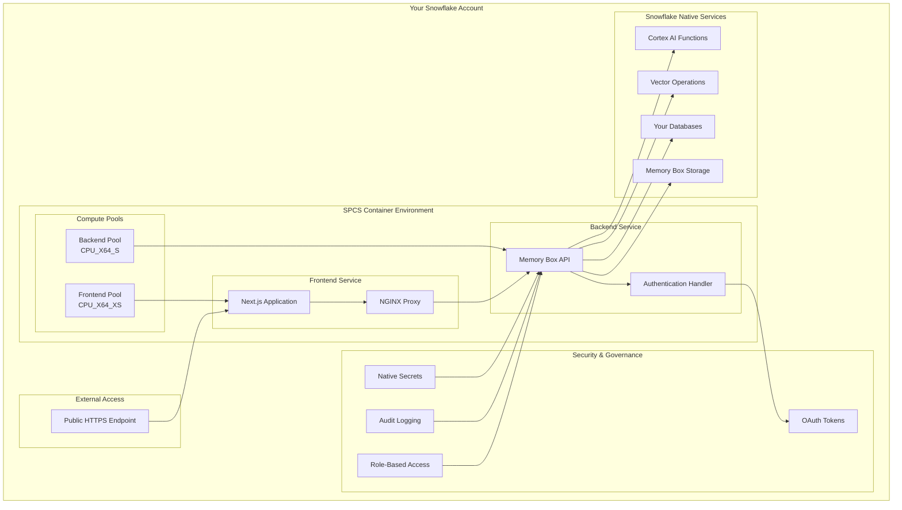
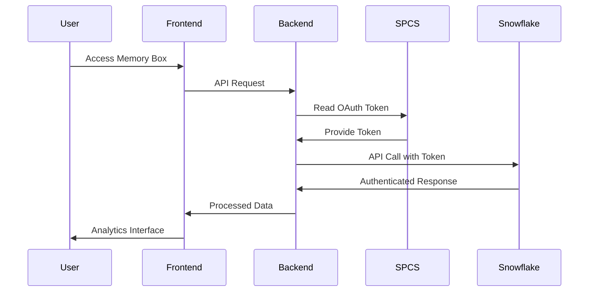

# SPCS Production Architecture

Memory Box on Snowflake leverages Snowpark Container Services (SPCS) to deliver enterprise-grade deployment with native Snowflake integration. This architecture ensures maximum security, performance, and operational simplicity by keeping all processing within your Snowflake environment.

## Architecture Overview



## Core Components

### Frontend Service Architecture

**Technology Stack**
- **Next.js 15** - Modern React framework with server-side rendering
- **NGINX** - High-performance reverse proxy and static file serving
- **Responsive Design** - Optimized for desktop and mobile analytics workflows

**Container Specifications**
```yaml
Frontend Service:
  Compute Pool: CPU_X64_XS
  Resources:
    CPU: 0.5-1.0 cores
    Memory: 512MB-1GB
  Scaling: 1-3 instances
  Endpoint: Public HTTPS
```

**Key Features**
- **Static Asset Optimization** - Efficient serving of optimized React bundles
- **API Proxying** - Seamless routing to backend services
- **Security Headers** - CSP and security headers for Snowflake integration
- **Health Monitoring** - Built-in health checks and monitoring endpoints

### Backend Service Architecture

**Technology Stack**
- **Node.js** - High-performance JavaScript runtime
- **Next.js API Routes** - Serverless-style API endpoints
- **Snowflake SDK** - Native Snowflake connectivity and operations

**Container Specifications**
```yaml
Backend Service:
  Compute Pool: CPU_X64_S
  Resources:
    CPU: 1-2 cores
    Memory: 2-4GB
  Scaling: 1-5 instances
  Endpoint: Internal only
```

**Key Features**
- **Snowflake Integration** - Direct REST API v2 connectivity
- **Memory Box Operations** - Native vector search and storage
- **Authentication Handling** - OAuth token management and validation
- **Error Recovery** - Robust error handling and retry mechanisms

## Native Snowflake Integration

### Memory Box Storage Architecture

Memory Box leverages Snowflake's native capabilities for enterprise-grade memory storage:

```sql
-- Memory Box table structure (conceptual)
CREATE TABLE MEMORY_BOX_STORAGE (
    memory_id STRING PRIMARY KEY,
    content STRING NOT NULL,
    content_type STRING NOT NULL,
    embedding VECTOR(FLOAT, 768) NOT NULL,
    owner_user STRING DEFAULT CURRENT_USER(),
    access_level STRING DEFAULT 'PRIVATE',
    created_at TIMESTAMP_NTZ DEFAULT CURRENT_TIMESTAMP(),
    metadata OBJECT
);
```

**Native Integration Benefits**
- **Cortex Embedding Generation** - Uses `SNOWFLAKE.CORTEX.EMBED_TEXT_768()` for vector creation
- **Vector Similarity Search** - Leverages `VECTOR_COSINE_SIMILARITY()` for memory retrieval
- **Native Security** - Inherits Snowflake's encryption and access controls
- **Automatic Indexing** - Snowflake optimizes vector search performance automatically

### Cortex AI Integration

Memory Box integrates deeply with Snowflake's Cortex AI capabilities:

**Claude 3.5 Sonnet Integration**
- **Native API Access** - Direct integration with Snowflake's Cortex Complete API
- **Tool Calling Support** - Advanced tool integration for data operations
- **Streaming Responses** - Real-time conversation capabilities
- **Cross-Region Support** - Access to latest AI models across regions

**Cortex Analyst Integration**
- **Text-to-SQL Generation** - Natural language to SQL query conversion
- **Semantic Model Support** - Integration with your data semantic models
- **Query Optimization** - Leverages Snowflake's query optimization
- **Result Interpretation** - AI-powered analysis of query results

### Authentication & Security

**OAuth Token Flow in SPCS**


**Security Features**
- **No Stored Credentials** - OAuth tokens automatically managed by SPCS
- **Token Refresh** - Automatic token refresh and rotation
- **Audit Integration** - All operations logged through Snowflake audit
- **Network Isolation** - Internal service communication only

## Performance Characteristics

### Compute Pool Optimization

**Frontend Pool (CPU_X64_XS)**
- **Optimized for UI Serving** - Efficient static asset delivery
- **Low Resource Usage** - Minimal CPU and memory requirements
- **Auto-Scaling** - Scales based on user demand
- **Cost Efficient** - Right-sized for frontend workloads

**Backend Pool (CPU_X64_S)**
- **Optimized for API Processing** - Handles Memory Box operations and Snowflake connectivity
- **Memory Box Operations** - Sufficient resources for vector operations
- **Concurrent Users** - Supports multiple simultaneous analytical sessions
- **Elastic Scaling** - Scales with analytical workload demands

### Memory Box Performance

**Vector Search Optimization**
```sql
-- Optimized similarity search pattern
SELECT 
    memory_id,
    content,
    VECTOR_COSINE_SIMILARITY(
        embedding, 
        SNOWFLAKE.CORTEX.EMBED_TEXT_768(?)
    ) as similarity_score
FROM MEMORY_BOX_STORAGE
WHERE similarity_score >= 0.7
ORDER BY similarity_score DESC
LIMIT 10;
```

**Performance Metrics**
- **Memory Search Latency** - <500ms for similarity search operations
- **Embedding Generation** - <200ms for text-to-vector conversion
- **Concurrent Operations** - Supports 50+ simultaneous memory operations
- **Storage Efficiency** - Optimized vector storage with automatic compression

## Deployment Architecture

### Container Lifecycle Management

**Image Management**
- **Versioned Deployments** - Semantic versioning for all container images
- **Rolling Updates** - Zero-downtime updates through SPCS
- **Rollback Capability** - Quick rollback to previous versions
- **Health Validation** - Automated health checks during deployments

**Service Management**
```yaml
Service Lifecycle:
  Build: Automated container builds
  Test: Integration testing in staging
  Deploy: Rolling deployment to production
  Monitor: Continuous health monitoring
  Scale: Automatic scaling based on demand
```

### Network Architecture

**Internal Communication**
- **Service Discovery** - SPCS native service discovery
- **Load Balancing** - Automatic load balancing across instances
- **Health Checks** - Continuous service health monitoring
- **Circuit Breakers** - Fault tolerance and recovery mechanisms

**External Access**
- **Public Endpoints** - Secure HTTPS endpoints for user access
- **SSL Termination** - Automatic SSL certificate management
- **Rate Limiting** - Built-in protection against abuse
- **Geographic Distribution** - Leverages Snowflake's global infrastructure

## Operational Excellence

### Monitoring & Observability

**Application Metrics**
- **Response Times** - API and UI response time monitoring
- **Error Rates** - Comprehensive error tracking and alerting
- **User Analytics** - Usage patterns and feature adoption
- **Resource Utilization** - CPU, memory, and storage monitoring

**Memory Box Metrics**
- **Memory Operations** - Storage and retrieval operation metrics
- **Vector Search Performance** - Similarity search latency and accuracy
- **Embedding Generation** - Text-to-vector conversion performance
- **Storage Growth** - Memory Box storage utilization trends

### Maintenance & Updates

**Automated Operations**
- **Health Monitoring** - Continuous service health validation
- **Auto-Recovery** - Automatic restart of failed services
- **Resource Optimization** - Dynamic resource allocation
- **Backup Management** - Automated backup of Memory Box data

**Update Procedures**
```yaml
Update Process:
  1. Build: Create new container versions
  2. Test: Validate in staging environment
  3. Deploy: Rolling update to production
  4. Validate: Confirm functionality
  5. Monitor: Watch for issues post-deployment
```

## Scalability & Performance

### Horizontal Scaling

**Frontend Scaling**
- **User Load** - Scales based on concurrent user sessions
- **Geographic Distribution** - Leverages Snowflake's global presence
- **CDN Integration** - Optimized static asset delivery
- **Session Management** - Efficient user session handling

**Backend Scaling**
- **API Load** - Scales based on Memory Box operation volume
- **Analytical Workload** - Adapts to analytical processing demands
- **Database Connections** - Efficient connection pooling and management
- **Memory Operations** - Scales with vector search and storage needs

### Vertical Scaling

**Resource Optimization**
- **CPU Allocation** - Right-sized compute for workload demands
- **Memory Management** - Optimized memory usage for vector operations
- **Storage Performance** - High-performance storage for Memory Box data
- **Network Bandwidth** - Sufficient bandwidth for analytical workflows

## Security Architecture

### Data Protection

**Encryption**
- **Data at Rest** - Snowflake native encryption for all Memory Box data
- **Data in Transit** - TLS encryption for all communications
- **Key Management** - Snowflake managed encryption keys
- **Compliance** - Meets enterprise encryption requirements

**Access Controls**
- **Authentication** - OAuth-based user authentication
- **Authorization** - Role-based access control through Snowflake RBAC
- **Audit Logging** - Comprehensive audit trail for all operations
- **Network Security** - Internal service communication only

### Compliance & Governance

**Regulatory Compliance**
- **SOC 2 Type II** - Inherits Snowflake's compliance certifications
- **HIPAA** - Healthcare data protection capabilities
- **GDPR** - European data protection compliance
- **FedRAMP** - Government cloud compliance (where applicable)

**Data Governance**
- **Data Lineage** - Track Memory Box data sources and usage
- **Retention Policies** - Configurable memory retention and archival
- **Privacy Controls** - User data anonymization and deletion
- **Access Auditing** - Complete audit trail for compliance reporting

---

## Next Steps

- **Deployment Planning**: Review [Deployment Guide](./deployment-guide.md)
- **Technical Planning**: Explore [Technical Considerations](./technical-considerations.md)
- **Analytics Transformation**: Learn about [Analytics Transformation](./analytics-transformation.md)

*SPCS Architecture: Enterprise-grade Memory Box deployment with native Snowflake integration.*
